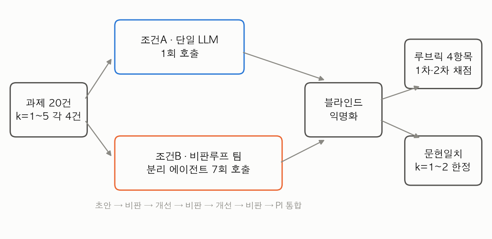
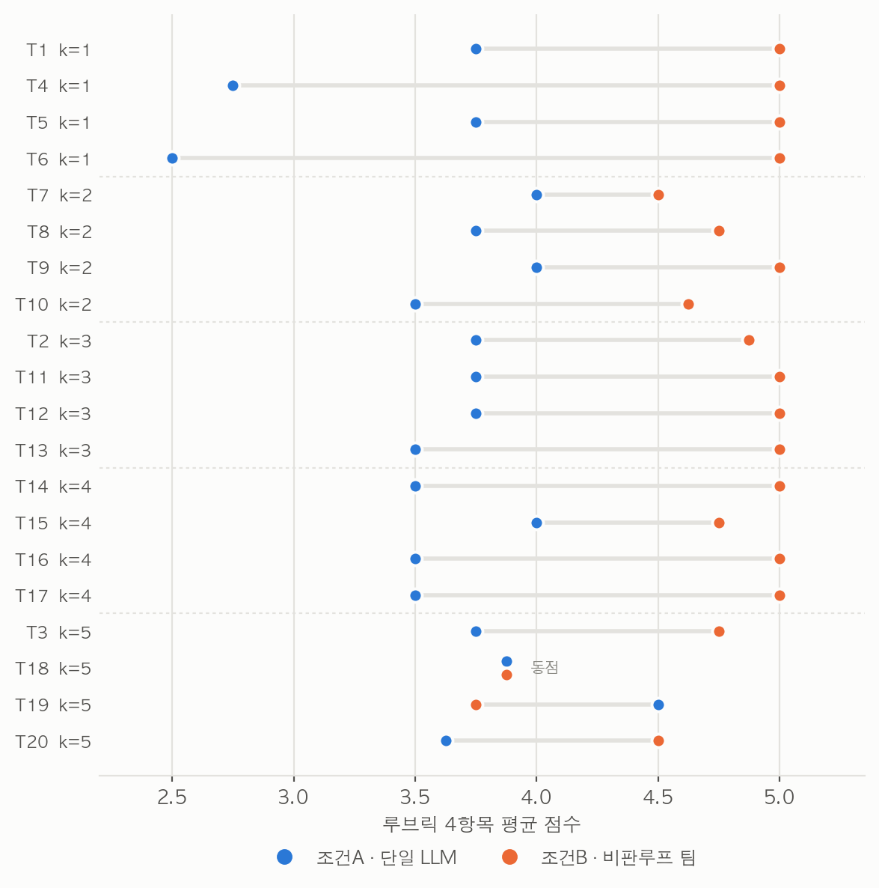
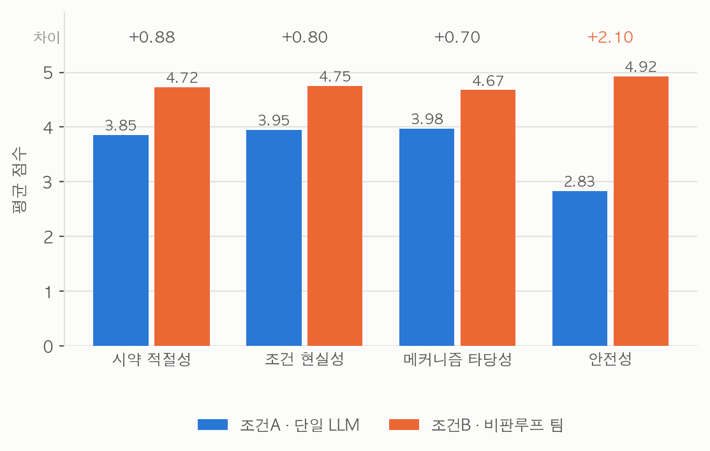
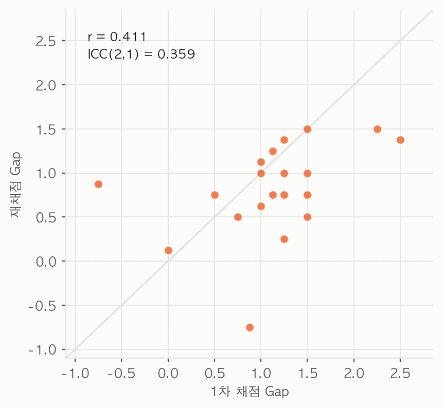
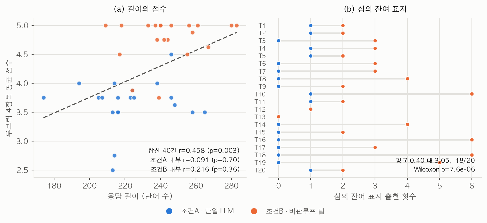
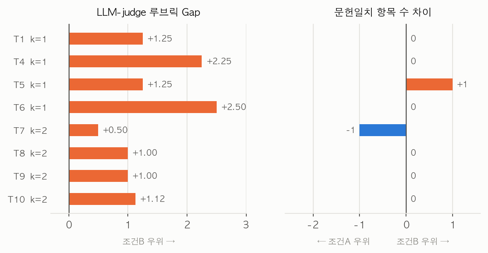

# 비판루프 멀티에이전트 팀은 더 나은 화학 설계를 하는가, 아니면 판정자가 심의의 흔적을 알아보는 것인가?

**부제: 조건민감 화학설계 과제 20건에서 LLM-judge 평가와 멀티에이전트 구조가 분리되지 않는 네 갈래 증거**

최호윤 · 연세대 AX 캠프 트랙1 (AI 연구 에이전트)

---

## 초록

대규모 언어모델을 전문가 에이전트로 나누고 비판 루프를 붙이면 단일 모델보다 나은 과학 설계를 얻는다는 보고가 축적되었다. 앵커 논문 The Virtual Lab은 이 구조로 나노바디 후보를 설계하고 웻랩 결합실험까지 통과시켰으나, "팀이 논의한다"는 조건 자체를 끄거나 이분화해 대조한 적은 없었다. 본 연구는 그 조건 하나만 조작변수로 바꾸었다. 조건민감도에 따라 k=1에서 k=5까지 층화한 화학설계 과제 20건을 준비하고, 각 과제를 단일 LLM 1회 호출과 서로 다른 에이전트 7회 호출로 구성된 비판루프 팀에 동일하게 투입한 뒤, 출처 라벨을 지운 상태로 판정자가 네 항목을 채점했다. 에이전트 호출은 모두 228회였고 셀프시뮬레이션 프록시는 쓰지 않았다. 루브릭 기준으로 팀은 20건 중 18건에서 앞섰고 Wilcoxon 검정에서 p=0.00019, 효과크기 dz는 1.61이었다. 그러나 네 갈래 후속 분석이 이 우위를 평가 방법과 분리하지 못하게 했다. 채점과 분리된 별도 호출에서 어느 쪽이 팀 산출물인지만 물었을 때 판정자는 20건 전부를 맞혔고, 판정자가 든 결정적 단서는 응답 길이가 아니라 비판과 정정과 보류라는 심의 과정의 잔여 흔적이었으며 그 흔적은 팀 응답에 실제로 유의하게 많았다. 점수 격차의 46.9%는 팀에만 안전 역할을 배치한 설계 비대칭에서 나왔다. 동일 모델의 독립 호출로 재채점하자 우위의 방향은 재현되었으나 크기는 재현되지 않아 과제 수준 격차의 두 라운드 간 ICC는 0.359였고 2건은 부호가 뒤집혔다. 정답이 문헌에 명확한 8건에서 문헌 표준조건 일치도를 재면 두 조건의 차이가 관찰되지 않았다. 이로부터 본 연구는 웻랩 검증 없이 판정자 점수만으로 멀티에이전트 구조의 우월성을 주장하는 평가 설계에서 구조가 텍스트에 남기는 흔적과 구조의 실제 효과가 분리되지 않는다고 결론한다.

**주제어**: 멀티에이전트 시스템, LLM-as-a-judge, 평가 편향, 비판 루프, 화학 반응조건 설계, 조건민감도

---

## 1. 서론

### 1.1 배경

학제간 과학 연구는 한 사람이 필요한 모든 전문성을 갖추기 어렵다는 제약을 안고 있다. 합성 경로를 짜는 화학자, 전이상태를 따지는 메커니즘 전문가, 스케일업 위험을 평가하는 공정안전 전문가가 같은 문제를 함께 들여다볼 때 비로소 실행 가능한 설계가 나온다. 대규모 언어모델을 여러 전문가 페르소나로 분할하고 서로 비판하게 만드는 접근은 이 제약을 소프트웨어로 대체하려는 시도였다.

이 방향의 도구들은 각기 다른 지점에서 멈춰 있다. ChemCrow는 외부 화학 도구를 호출해 계산의 정확성을 확보했으나, 도구가 답을 주지 못하는 설계 판단에서는 여전히 단일 모델의 추론에 의존했다. Coscientist는 자동화 장비와 결합해 실제 반응을 수행했지만 장비가 없는 환경으로는 옮겨지지 않았다. 생성형 에이전트 시뮬레이션 연구들은 다수 에이전트의 사회적 상호작용을 정교하게 재현했으나 산출물의 과학적 정확성 자체를 검증 대상으로 삼지 않았다. 한편 자기 비판을 통한 반복 개선이 단일 모델의 출력을 향상시킨다는 보고도 축적되었는데, 이 계열의 평가는 대부분 모델 자신 또는 다른 언어모델의 판정에 의존한다.

판정자를 언어모델로 두는 관행에는 알려진 함정이 있다. 판정자는 제시 순서에 따라 앞쪽을 선호하고, 더 긴 답을 더 좋은 답으로 읽으며, 자기 계열 모델의 출력을 선호하는 경향을 보인다는 것이 대화형 벤치마크 연구에서 보고되었다. 그러나 이 편향들이 멀티에이전트 구조를 평가할 때 어떻게 작동하는지는 별도로 다뤄지지 않았다. 멀티에이전트 파이프라인은 정의상 더 많은 단계를 거치고 그 과정을 최종 텍스트에 남기므로, 판정자가 그 흔적에 반응한다면 그 반응은 구조의 효과와 체계적으로 뒤섞인다.

### 1.2 앵커 논문과 그 빈틈

앵커 논문 The Virtual Lab은 이 계열에서 가장 완결적인 형태를 보였다. PI 에이전트가 전문가 팀을 구성하고, 팀회의와 개별회의와 병렬회의라는 세 종류의 회의를 거치며, 다섯 단계 워크플로우로 SARS-CoV-2 변이체를 겨냥한 나노바디 후보 92개를 설계했다. 설계된 후보는 웻랩에서 발현되고 결합했으며 인간의 직접 입력은 전체 과정의 1.3%에 불과했다. 멀티에이전트 팀이 실제로 작동하는 분자를 만들어냈다는 점에서 이 연구는 강한 증거를 제시했다.

그러나 앵커의 논증을 형식화해 따라가면 검증되지 않은 지점이 하나 남는다. 앵커에서 "팀이 비판 루프를 거쳐 논의한다"는 조건은 언제나 참으로 고정된 전제였고, 그 조건을 끄거나 단일 모델로 대체했을 때 산출물이 어떻게 달라지는지는 대조되지 않았다. 팀 구조가 성과의 원인이라는 주장은 그 구조를 제거한 대조군 없이 성립하지 않는다. 앵커의 웻랩 검증은 설계가 작동한다는 것을 입증했으나 팀이었기 때문에 작동했다는 것을 입증하지는 않았다.

### 1.3 본 연구의 기여

본 연구는 그 한 지점만 건드렸고, 세 가지를 기여한다.

1. 앵커에서 고정된 전제였던 "팀이 논의한다"를 두 값을 갖는 조작변수로 이분화하고, 나머지 논증 구조와 에이전트 정의 형식은 앵커의 것을 유지한 채 대조 실험을 수행했다.
2. 팀 조건을 단일 호출 내부의 역할연기가 아니라 서로 다른 에이전트 7회 호출로 실제 분리해 실행했다. 동일 주제의 선행 파일럿이 이 조건을 셀프시뮬레이션으로 대체했던 결함을 제거하고 같은 질문을 다시 검증했다.
3. 판정자 점수 단독에 의존하는 평가에서 구조의 효과와 구조의 흔적이 분리되지 않는다는 증거를 네 경로에서 제시했다. 채점과 분리된 조건 식별 검사, 채점 항목별 격차 분해, 재채점 신뢰도, 응답의 표면적 특성이 각각 다른 방식으로 같은 결론을 지지했다.

---

## 2. 재사용한 아키텍처

본 연구는 에이전트 정의 형식과 회의 구조를 앵커에서 그대로 가져왔다. 새 아키텍처를 만들지 않은 것은 의도적이었다. 팀 조건이 앵커의 팀과 다르면, 관찰된 차이가 팀 구조 때문인지 우리가 바꾼 부분 때문인지 구분할 수 없다.

모든 에이전트는 앵커와 동일하게 Title, Expertise, Goal, Role 네 요소로 정의했다.

| Title | Expertise | Goal | Role |
|---|---|---|---|
| PI | AI 보조 화학 연구 설계 총괄 | 팀 논의를 종합해 최종 설계를 확정한다 | 마지막 라운드에서 전체 논의를 통합한다 |
| 합성화학자 | 반응 경로와 시약 선택 | 실행 가능한 합성 조건을 제시한다 | 초안을 작성한다 |
| 반응메커니즘 전문가 | 전자이동과 전이상태 분석 | 메커니즘상 타당성을 확보한다 | 1차 비판을 반영해 개선안을 낸다 |
| 공정안전 전문가 | 실험실 안전성 및 스케일업 위험성 평가 | 안전상 결함을 제거한다 | 2차 비판을 반영해 최종 개선안을 낸다 |
| Scientific Critic | 과학적 추론에 대한 비판적 평가 | 오류와 누락과 위험을 지적한다 | 매 라운드마다 직전 산출물을 비판한다 |

**표 1.** 본 연구에서 사용한 에이전트의 네 요소 정의.

회의는 앵커가 정의한 세 종류 가운데 팀회의만 사용했다. 팀 조건은 4라운드 팀회의에 해당하며, 각 라운드는 전문가의 산출과 Critic의 비판으로 이루어지고 마지막 라운드에서 PI가 통합한다. 개별회의와 병렬회의는 본 연구의 조작변수와 무관해 쓰지 않았다.

여기서 미리 밝혀둘 설계상의 사실이 하나 있다. 팀에는 공정안전 전문가가 배치되어 있으나 단일 LLM 조건에는 그에 대응하는 장치가 없다. 이 비대칭은 앵커의 팀 구성을 그대로 재사용한 결과이며, 5.5절에서 그것이 결과에 미친 영향을 분리해 보고한다.

---

## 3. 방법

### 3.1 앵커 5단계 워크플로우와의 대응

| 앵커(The Virtual Lab) | 본 연구 | 대응 관계 |
|---|---|---|
| ① 팀 선택 | ① 팀 구성 정의 | 에이전트 네 요소 정의와 역할 배치를 그대로 재사용했다 |
| ② 프로젝트 명세화 | ② 과제 세트 명세화 | 타겟 분자 확정 대신 조건민감도로 층화한 과제 20건을 확정했다 |
| ③ 도구 선택 | ③ 비교 조건 설계 | 외부 계산도구 선택 대신 조작변수의 두 값을 설계했다 |
| ④ 도구 구현 | ④ 과제×조건 실행 | 코드 작성 대신 과제 20건을 두 조건에 투입해 160회를 호출했다 |
| ⑤ 워크플로우 설계와 반복최적화 | ⑤ 평가와 통계검정 | 가중점수함수 최적화 대신 채점 68회와 가설검정을 수행했다 |

**표 2.** 앵커의 다섯 단계와 본 연구 다섯 단계의 1:1 대응. 호출 내역은 3.6절에 있다.

### 3.2 논증 사슬과 소절의 대응

| 소절 | 논증 단계 |
|---|---|
| 3.3 팀 구성 정의 | FOL-1 |
| 3.4 비교 조건 설계 | FOL-2 |
| 3.5 과제 세트 구축 | FOL-3 |
| 3.6 과제×조건 실행 | FOL-4 |
| 3.7 블라인드 익명화 | FOL-5 |
| 3.8 조건 식별 검사 | FOL-5a |
| 3.9 루브릭 채점 | FOL-6 |
| 3.10 항목별 분해와 강건성 설계 | FOL-6a |
| 3.11 재채점 | FOL-6b |
| 3.12 표면적 특성 측정 | FOL-6c |
| 3.13 문헌일치 보조지표 | FOL-7 |
| 5.2 H1 검정 | FOL-8 |
| 5.3 H2 검정 | FOL-9 |
| 6.5 종합 주장 | FOL-10 |

**표 3.** 방법·결과 소절과 논증 단계의 대응.

### 3.3 팀 구성 정의

2절의 다섯 에이전트를 Title과 Expertise를 명시한 프롬프트로 각각 인스턴스화했다. 각 에이전트는 독립 호출로 실행되었고 직전 에이전트의 산출물을 프롬프트로 전달받았다. 에이전트 사이에 공유되는 숨은 상태는 없었다.

### 3.4 비교 조건 설계

조작변수는 두 값을 가졌다. 조건A는 단일 LLM에 해당하며, 동일한 과제를 토론이나 검토 없이 1회 프롬프트로 제시하고 응답 하나를 받았다. 프롬프트에는 혼자 최종 답을 제시하라는 지시를 명시했다. 조건B는 비판루프 팀에 해당하며, 합성화학자의 초안, Critic의 1차 비판, 메커니즘 전문가의 개선안, Critic의 2차 비판, 공정안전 전문가의 최종 개선안, Critic의 3차 비판, PI의 최종 통합이라는 7회의 서로 다른 에이전트 호출로 실행했다. 한 호출 안에서 여러 역할을 연기하는 셀프시뮬레이션은 금지했다.

두 조건의 응답 서식과 분량은 같은 지시문으로 통일하려 했다. 조건A의 단일 호출과 조건B의 PI 통합 호출에 동일한 형식 지시를 주어, 시약과 용매와 온도·시간과 work-up 절차와 핵심 근거라는 다섯 항목으로 200단어에서 300단어 사이로 쓰게 했다. 서론이나 자기소개를 붙이지 않도록 명시했다. 이 통일 시도가 실제로는 성공하지 못했음을 5.7절에서 보고한다. 그림 1이 전체 설계를 요약한다.

**그림 1.** 과제 20건이 두 조건으로 갈라져 실행되고, 익명화를 거쳐 세 갈래 평가로 들어가는 흐름.

### 3.5 과제 세트 구축

조절 변수의 수, 부반응 가능성, 문헌상 수율 분산을 기준으로 화학설계 과제의 조건민감도를 다섯 등급으로 나누었다. k=1은 조건이 표준화되어 교과서적 답이 존재하는 반응이고, k=5는 조건 하나만 바뀌어도 주생성물이 뒤집히는 경쟁 반응계다. 각 등급에 4건씩 배정해 20건을 구성했다. 등급은 저자 한 사람의 사전 판정이며 독립적인 검증을 받지 않았다. 이 판정의 타당성에 관한 문제는 7.2절에 적었다.

| k | 과제 |
|---|---|
| 1 | 표준 환원적 아민화, 표준 피셔 에스터화, 표준 그리냐르 부가, 표준 윌리엄슨 에터화 |
| 2 | 선택적 모노-Boc 보호, 선택적 모노아세틸화, 케톤 선택적 환원, 모노브롬화 선택성 제어 |
| 3 | 화학선택적 환원, 선택적 에스터 가수분해, 에폭사이드 개환 위치선택성, E-선택적 비티히 반응 |
| 4 | 프리델-크래프츠 파라선택성, 반마르코브니코프 하이드로보레이션, SN1 대 SN2 용매 제어, directed ortho-metalation 위치제어 |
| 5 | 분자내 딜스-알더 대 이량화 경쟁, 나자로프 고리화 torquoselectivity, 도미노 마이클-알돌 부분입체선택성, 옥시-코프 대 레트로-엔 경쟁 제어 |

**표 4.** 조건민감도 등급별 과제 구성. 과제 프롬프트 전문은 재현자료에 있다.

과제는 모두 선행 파일럿과 겹치지 않게 새로 작성했고, 반응 유형만 표준 유기화학 지식에 기반했다.

### 3.6 과제×조건 실행

과제 20건 전부를 두 조건에 동일하게 투입했다. 호출 내역은 다음과 같다. 응답 생성이 160회로 조건A 20회와 조건B 140회였다. 평가가 68회로 1차 루브릭 채점 20회, 재채점 20회, 조건 식별 검사 20회, 문헌일치 채점 8회였다. 합계는 228회다. 아래에 적는 폐기분과 재실행분은 이 집계에 넣지 않았다. 기반 모델은 Claude 계열 단일 모델이었으며, 각 호출은 프롬프트만 입력으로 받는 독립 호출이었다.

실행 과정의 실패와 수정을 축소 없이 적는다. 20건을 한 번에 실행한 시도는 두 차례 모두 세션 사용량 한도에 걸려 완주하지 못했다. 이후 등급별 4건씩 다섯 배치로 나눠 배치당 36회로 실행했다. 분할 초기에는 배치 필터 인자가 배열이 아닌 문자열로 전달되어 매 배치마다 20건 전체가 실행되는 결함이 있었고, 문자열 파싱 방어 코드로 고친 뒤 1건 규모의 최소 테스트로 필터 동작을 먼저 확인했다. 한 과제에서는 초안 호출이 빈 값을 반환했는데 그 값이 검사 없이 다음 비판 단계로 전달되어, 빈 초안을 비판하고 개선하는 가짜 체인이 완주하는 데이터 손상이 생겼다. 해당 과제를 폐기하고, 각 호출 결과가 빈 값이면 즉시 예외를 던져 그 과제를 재실행 대상으로 넘기는 검사를 넣은 뒤 다시 실행했다. 산발적 연결 종료 오류로 실패한 과제들은 이 검사에 걸러졌고 실패분만 재실행해 회수했다. 최종 데이터셋의 20건은 모두 검사를 통과한 완주 결과다.

### 3.7 블라인드 익명화

과제별로 조건A의 응답과 조건B의 PI 통합 응답을 짝지은 뒤 출처 라벨을 지우고 제안1과 제안2로만 제시했다. 제시 순서는 과제마다 교대하도록 배정했다. 3.4절의 서식·분량 통일은 이 단계의 블라인딩을 강화하기 위한 조치였다. 선행 파일럿에서 판정자가 문체와 분량만으로 팀 조건을 90% 알아맞혀 블라인딩이 사실상 무효화되었으므로, 그 원인을 실행 단계에서 미리 없애려 했다.

### 3.8 조건 식별 검사

블라인딩이 유지되었는지를 순환 없이 재기 위해 별도의 검사를 두었다. 1차 채점에는 두 제안 중 어느 쪽이 더 숙고를 거친 것처럼 보이는지 묻는 문항이 딸려 있었으나, 그 문항은 조건을 묻지 않고 품질 인상을 물었으며 네 항목 점수와 같은 생성에서 나왔으므로 점수와 순환적이다. 따라서 그것만으로는 블라인딩 실패를 주장할 수 없다.

이를 보완해, 채점 문구를 완전히 제거한 자료를 새로 만들고 판정자에게 과제와 두 익명 제안만 준 뒤 한 가지만 물었다. 둘 중 하나는 단일 모델이 한 번에 작성한 것이고 다른 하나는 서로 다른 전문가 에이전트들이 세 차례 비판과 수정을 거쳐 만든 것이라고 알려준 다음, 어느 쪽이 후자인지 지목하게 했다. 점수는 매기지 못하게 했고, 판단에 사용한 가장 결정적인 텍스트 단서 하나를 짧게 적게 했다. 과제별로 독립 판정자를 두어 20건을 병렬 실행했다. 이 검사는 1차 채점과 다른 호출에서 이루어졌으며 각 판정자는 자기 프롬프트만 입력으로 받았다.

### 3.9 루브릭 채점

판정자에게 과제와 두 익명 제안을 주고 네 항목을 1점에서 5점으로 채점하게 했다. 항목은 시약 적절성, 조건 현실성, 메커니즘 타당성, 안전성이었다. 네 항목의 평균을 각 조건의 점수로 삼고, 조건B의 평균에서 조건A의 평균을 뺀 값을 과제별 Gap으로 정의했다. 채점은 구조화 출력 스키마로 받았으나 스키마가 정수를 강제하지는 않았고, 실제 관측된 점수 집합은 2, 3, 3.5, 4, 4.5, 5였다. 항목 점수 160개 가운데 15개가 반점이었다. 따라서 보고된 항목 평균과 Gap은 0.5점 간격을 포함한 척도 위에서 계산된 값이다.

### 3.10 항목별 분해와 강건성 설계

루브릭의 안전성 항목은 조건B에만 존재하는 공정안전 전문가 역할과 직접 대응한다. 이 비대칭이 격차에 기여한 몫을 분리하기 위해, Gap을 네 항목으로 분해해 보고하고, 안전성을 제외한 세 항목만으로 Gap을 다시 계산해 동일한 검정을 반복하는 절차를 분석 계획에 포함했다.

### 3.11 재채점

1차 채점이 판정자 1회 호출이었으므로 채점의 재현성을 알 수 없었다. 이를 측정하기 위해 20건 전부를 다시 채점했다. 재채점은 1차와 동일한 블라인드 자료를 쓰고 제시 순서도 그대로 유지해, 두 라운드의 차이가 판정자 호출에서만 오도록 했다. 재채점자에게는 다른 자료 열람을 금지했다. 항목 수준 일치도, 과제 수준 Gap의 상관과 ICC(2,1), 조건 식별의 재현 여부를 각각 나누어 보고했다.

여기서 범위를 분명히 해둔다. 재채점자는 1차와 같은 계열의 모델이며 호출만 독립이다. 따라서 이 절차는 같은 모델을 두 번 물었을 때의 재현성을 재는 것이고, 모델 계열을 바꿨을 때의 재현성이나 모델 고유의 편향은 재지 못한다. 또한 제시 순서를 일부러 고정했으므로 이 절차로는 순서 효과를 검정할 수 없다.

### 3.12 표면적 특성 측정

판정자가 내용의 정확성이 아니라 표면적 특성을 보았다는 설명은 측정 없이는 추측에 머문다. 이를 검정 가능한 형태로 바꾸기 위해 세 가지를 재고 점수와의 관계를 확인했다.

첫째는 응답 길이로, 한글과 영숫자 토큰을 세어 단어 수로 삼았다. 둘째는 안전 관련 주제어의 출현 빈도로, 안전·위험·발열·폭발·인화·독성·환기·후드·보호구·장갑·고글·퀜칭·냉각·질소·불활성·MSDS·피부·흡입·폐기 열아홉 개 어휘의 등장 횟수를 합산했다. 셋째는 심의 잔여 표지로, 비판·반박·기각·철회·정정·보류·재확인·미검증·미해결·논쟁·게이트·대안·배제·폐기·채택하지 및 PI 종합·PI 최종·종합하면을 합산했다. 세 번째 지표는 3.8절의 식별 판정자들이 실제로 든 단서를 사후에 어휘화한 것이다.

길이와 점수의 관계를 볼 때는 두 조건을 합산한 상관과 조건 내부 상관을 함께 계산했다. 합산 상관은 조건B가 더 길고 동시에 더 높은 점수를 받았다는 사실만으로도 양수가 되므로, 설명하려는 격차 자체에 의해 기계적으로 만들어질 수 있다. 조건 내부 상관은 그 교란을 받지 않는다. 두 번째와 세 번째 지표는 서술의 질이 아니라 양을 재는 거친 대리지표이며, 그 한계를 7.2절에 적었다.

### 3.13 문헌일치 보조지표

실험실이 없어 설계된 조건으로 실제 합성을 시도할 수 없다는 제약이 있었다. 이 제약을 없애지는 못하지만, 정답이 문헌에 명확한 구간에서는 판정자와 독립된 객관 지표를 얹을 수 있었다.

k=1과 k=2의 8건에 한해 문헌 표준조건 일치도를 채점했다. k=3 이상은 문헌상 정답이 하나로 정해지지 않아 적용하지 않았다. 객관성을 확보하기 위해 판정 이전에 과제별 표준조건을 네 개 축으로 명문화했다. 축의 구성은 과제 성격에 따라 달랐다. 표준 반응에서는 시약·촉매, 용매, 온도, 선택성 근거를 축으로 삼았고, 통계적 선택성이 지배하는 과제에서는 당량, 적가·희석 방식, 용매·촉매, 한계 인식을 축으로 삼았다. 과제별 축 구성과 기준 전문은 재현자료에 있다.

채점자는 사전 확정된 기준만 사용해 각 축을 일치 1점과 불일치 0점으로 판정했고, 축을 누락한 경우도 불일치로 처리했다. 조건 라벨을 지운 파일만 제공하고 다른 자료 열람을 금지했으며, 제시 순서는 루브릭 채점과 같게 두어 두 지표를 같은 조건에서 비교할 수 있게 했다. 과제별로 독립 채점자를 두어 8건을 병렬 채점했다.

채점 이후 화학 검토에서 기준 자체의 오류 두 건이 발견되어 정정하고 재채점했다. 하나는 대칭 다이올의 모노아세틸화에서 아세트산 무수물 당량 기준을 0.9에서 1.0당량으로 좁혀 놓은 것이다. 이 반응의 선택성은 통계적으로 결정되므로 당량을 낮출수록 모노 대 다이 비가 개선된다. 이항 모델로 계산하면 0.3당량에서 약 11대 1이고 1.0당량에서 약 2대 1이므로, 저당량은 결함이 아니라 표준 전략이다. 다른 하나는 다이아민의 모노-Boc 보호에서 허용 용매를 염화메틸렌계로만 열거한 것이다. Boc2O 아민 보호에서는 테트라하이드로퓨란과 물의 이상계나 메탄올도 통용 매질이다. 두 정정의 영향은 5.9절에 정정 전후 값을 함께 적었다.

---

## 4. 분석 계획

검정을 실행하기 전에 다음을 정했다.

**가설.** H1은 과제별 Gap의 중앙값이 0보다 크다는 것이다. H2는 Gap을 조건민감도 k에 회귀했을 때 기울기가 양수라는 것이다.

**검정.** H1은 대응표본 Wilcoxon signed-rank 검정으로, H2는 단순선형회귀 기울기 검정으로 판정했다. 유의수준은 양측 0.05로 두었다.

**반증 기준.** H2는 기울기가 유의하게 양수일 때만 지지되고, 유의하지 않거나 음수이면 기각한다.

**보고 규칙.** 효과크기는 Cohen's dz로 보고하고, 평균 Gap과 dz와 회귀 기울기에는 부트스트랩 백분위 95% 신뢰구간을 붙였다. 재표본 2만 회, 난수 시드 20260731을 사용했다. Wilcoxon 검정은 동점이 없으면 정확검정을, 동점이 있으면 정규근사를 본문 수치로 삼고 동점 제외 정확검정 값을 함께 적었다. 다중검정 보정은 적용하지 않았고, 이 사실과 그 함의를 7.2절에 적었다.

**추가 분석의 지위.** 3.8절과 3.10절부터 3.12절까지의 분석은 1차 결과를 본 뒤에 계획한 사후 분석이다. H1과 H2의 판정을 바꾸는 데 쓰지 않았고, 관찰된 격차를 해석하는 데만 사용했다. 이 구분을 지키기 위해 사후 분석에는 반증 기준을 걸지 않았으며, 사후 분석에서 나온 경계선 p값은 보정 없이 읽어야 한다.

---

## 5. 결과

### 5.1 조건 식별 검사 — 블라인딩이 유지되지 않았다

채점과 분리된 별도 호출에서 어느 쪽이 멀티에이전트 산출물인지만 물었을 때, 판정자는 20건 전부를 맞혔다. 무작위 추측을 귀무가설로 한 이항검정의 p값은 0.0000019였고, 20건 모두 확신도를 높음으로 보고했다. 1차 채점에 딸려 있던 더 숙고돼 보이는 쪽 지목과도 20건 전부에서 일치했다.

판정자가 든 결정적 단서는 길이나 상세함이 아니었다. 20건의 단서 서술은 대부분 심의 과정의 잔여 흔적을 지목했다. 예를 들어 어떤 대안을 명시적으로 기각했다는 서술, 앞선 주장을 정정하거나 철회한 흔적, 판단을 보류하거나 후속 과제로 분리했다는 표현, 근거가 미검증이라고 스스로 유보한 문장이 단서로 제시되었다. 한 건에서는 최종 응답에 남은 PI라는 역할명 자체가 단서로 지목되었다. 이 지목이 텍스트에 실제로 대응하는지는 5.7절에서 확인했다.

이 결과가 3.7절의 개선 시도와 어긋난다는 점을 밝힌다. 서식과 분량 통일은 선행 파일럿의 90% 식별률을 낮추려는 조치였으나 식별률은 100%였다. 다만 20건 중 20건과 50건 중 45건의 차이는 통계적으로 구별되지 않으며 Fisher 정확검정의 p값은 0.312다. 또한 두 측정은 서로 다른 질문을 썼으므로, 정확한 서술은 통일이 식별률을 낮추지 못했다는 것이다.

### 5.2 H1 — 루브릭 기준 팀의 우위

과제 20건 가운데 조건B가 우위인 경우가 18건, 동점이 1건, 조건A가 우위인 경우가 1건이었다. 조건A의 평균 점수는 3.650이고 표준편차는 0.427이었으며, 조건B는 평균 4.769에 표준편차 0.370이었다. 평균 Gap은 1.119이고 95% 신뢰구간은 0.812에서 1.406이었다. 동점 1건이 있어 Wilcoxon 정규근사를 본문 수치로 삼으면 검정통계량 2.5에 p값 0.00019이고, 동점을 제외한 정확검정에서는 p값이 0.000019였다. 효과크기 dz는 1.61이고 신뢰구간은 0.962에서 3.329였다. 유의수준 0.05에서 H1은 지지되었다.

**그림 2.** 과제별 조건A와 조건B의 루브릭 평균 점수. 점선은 조건민감도 등급의 경계다.

### 5.3 H2 — 조건민감도에 따른 격차, 방향이 뒤집힘

Gap을 k에 회귀한 기울기는 −0.266이고 95% 신뢰구간은 −0.464에서 −0.038이었다. 상관계수는 −0.554, p값은 0.011이었다. 과제를 하나씩 빼고 20회 재적합했을 때 기울기는 −0.290에서 −0.187 사이에 머물고 p값은 항상 0.05 미만이었으므로, 이 부호는 특정 과제 하나에 기인하지 않는다.

이 결과는 경계선 서술 규칙의 적용 대상이므로 세 가지를 함께 밝힌다. 첫째, p값은 0.011이고 사전에 정한 유의수준은 0.05이므로 통계적으로 유의하다. 둘째, 사전 반증 기준은 기울기가 유의하게 양수일 때만 H2를 지지하는 것이었으므로 이 결과는 H2를 기각한다. 셋째, 효과의 방향은 가설과 반대다.

다만 이 반전을 등급이 오를 때마다 격차가 줄어드는 관계로 읽어서는 안 된다. 세 가지 이유가 있다. 첫째, 등급별 평균은 단조가 아니다. k=2의 평균 0.906이 k=3의 1.281과 k=4의 1.312보다 낮다. 둘째, 순위 기반 Spearman 상관은 −0.439에 p값 0.0525로 유의수준을 넘지 못했다. 안전성을 제외한 세 항목으로 계산하면 −0.492에 p값 0.0276으로 유의했다. 셋째, k=1~2를 k=4~5와 묶어 비교하면 평균 1.359 대 0.797이지만 Mann-Whitney 검정의 p값은 0.315로 유의하지 않다. 즉 선형회귀에서는 유의한 음의 기울기가 관찰되지만, 등급을 거칠게 묶은 대비나 순위 검정에서는 그 신호가 유지되지 않는다.

| k | 과제 수 | 평균 Gap (4항목) | 평균 Gap (3항목) |
|---|---|---|---|
| 1 | 4 | 1.812 | 1.583 |
| 2 | 4 | 0.906 | 0.625 |
| 3 | 4 | 1.281 | 1.000 |
| 4 | 4 | 1.312 | 1.083 |
| 5 | 4 | 0.281 | −0.333 |

**표 5.** 조건민감도 등급별 평균 Gap. k=5의 세 항목 평균이 음수인 것은 T19 한 과제에 의존한다. T19를 빼면 이 값은 +0.111이 되며, T19는 5.6절에서 두 채점 라운드 사이에 부호가 뒤집힌 두 과제 중 하나다.

조작 점검에서 문제가 발견되었다. 절대 점수를 k에 회귀하면 조건A는 오히려 상승하고 조건B는 하강한다. 조건A는 상관 0.447에 p값 0.048이고 k=1 평균 3.188에서 k=5 평균 3.938로 올라갔으며, 조건B는 상관 −0.527에 p값 0.017이었다. 판정자가 단일 모델의 답을 교과서적 반응보다 경쟁 반응계에서 더 높게 평가했다는 뜻이다. 이는 등급이 루브릭이 재는 것을 따라가지 못하거나, 루브릭이 화학적 난이도를 따라가지 못한다는 것을 시사한다. 어느 쪽이든 H2의 해석을 약화시키며, 7.2절에 한계로 적었다.

### 5.4 격차가 안전성 항목에 편중되어 있다

| 항목 | 조건A | 조건B | 차이 | 차이의 비중 | Wilcoxon p |
|---|---|---|---|---|---|
| 시약 적절성 | 3.850 | 4.725 | +0.875 | 19.6% | 0.0019 (근사, 동점 2건) |
| 조건 현실성 | 3.950 | 4.750 | +0.800 | 17.9% | 0.0094 (정확) |
| 메커니즘 타당성 | 3.975 | 4.675 | +0.700 | 15.6% | 0.0121 (정확) |
| 안전성 | 2.825 | 4.925 | +2.100 | 46.9% | 0.0001 (근사, 동점 1건) |

**표 6.** 루브릭 항목별 조건 간 평균 점수와 차이. 비중은 네 항목 차이의 합 4.475에 대한 몫이다.

안전성의 차이는 단일 항목으로 가장 크고 네 항목 차이 합의 46.9%를 차지한다. 다만 이는 과반이 아니므로, 격차가 이 항목 하나에서 나왔다고 말할 수는 없다. 조건A의 안전성 점수는 20건 중 17건이 2점 또는 3점이었고 나머지 세 건은 3.5점과 4점이었으며, 조건B는 18건이 5점이었다. 2절에서 미리 밝힌 설계 비대칭이 이 결과의 직접적 원인으로 보인다. 팀에는 공정안전 전문가가 있고 단일 LLM에는 없는데 루브릭에는 안전성 항목이 있다.

**그림 3.** 루브릭 네 항목의 조건별 평균 점수와 그 차이.

### 5.5 안전성을 제외해도 격차는 남는다

안전성을 뺀 세 항목으로 Gap을 다시 계산하고 같은 검정을 반복했다. 평균 Gap은 0.792이고 신뢰구간은 0.400에서 1.142였다. 조건B 우위가 17건, 동점이 1건, 조건A 우위가 2건이었다. Wilcoxon 정규근사 p값은 0.0057이고 dz는 0.906으로 신뢰구간은 0.362에서 2.625였다. H2 회귀 기울기는 −0.338, p값은 0.010이었다.

두 결론은 모두 유지되었다. H1은 여전히 지지되고 H2는 여전히 반대 방향으로 기각된다. 다만 효과크기가 1.61에서 0.906으로 내려갔다. 안전성 항목의 비대칭은 격차의 크기를 부풀렸으나 격차의 존재를 만들어내지는 않았다.

### 5.6 같은 모델을 두 번 물으면 방향은 남고 크기는 사라진다

20건 전부를 같은 계열 모델의 독립 호출로 다시 채점했다. 방향에 관한 결론은 재현되었다. 재채점에서 조건B 우위는 19건, 조건A 우위는 1건이었고 동점은 없었으므로 정확검정을 적용해 p값은 0.0000477이었다. 평균 Gap은 0.8125이고 dz는 1.517이었다. 항목별 편중도 그대로였다. 안전성 차이는 1.925였고 나머지 세 항목은 0.400에서 0.500 사이였다. H2 회귀 기울기는 −0.166으로 p값은 0.0473이었으며, Spearman 상관은 −0.376에 p값 0.1019로 1차와 같은 양상을 보였다.

크기에 관한 결론은 재현되지 않았다. 과제 수준 Gap의 두 라운드 상관은 0.411이고 p값은 0.072로 유의하지 않았으며, ICC(2,1)은 0.359에 그쳤다. 항목 수준에서 두 라운드가 정확히 같은 점수를 준 비율은 28.1%였고, 1점 이내로 일치한 비율은 95.0%였으며 항목 수준 ICC는 0.703이었다. 20건 중 2건은 부호까지 뒤집혔다. T19는 1차에서 −0.750이었다가 재채점에서 +0.875가 되었고, T20은 +0.875에서 −0.750으로 바뀌었다.

반면 조건 식별은 완벽하게 재현되었다. 재채점에서도 판정자는 20건 전부에서 조건B를 더 숙고된 쪽으로 지목했고, 두 라운드가 지목한 대상은 20건 모두 같았다.

이 대비가 이 절의 요점이다. 같은 모델은 어느 쪽이 팀인지는 흔들림 없이 알아보았고, 그 팀이 얼마나 더 나은지는 일관되게 답하지 못했다. 3.11절에 적은 대로 이 절차는 모델 계열을 바꾸지 않았으므로, 판정자를 실제로 교체했을 때의 재현성은 여전히 미지다.

**그림 4.** 1차 채점과 재채점의 과제별 Gap. 대각선은 두 라운드가 일치하는 선이다.

### 5.7 심의의 흔적은 남았고, 길이 기제는 지지되지 않는다

5.1절의 판정자들이 지목한 단서가 텍스트에 실제로 대응했다. 심의 잔여 표지는 조건A에서 평균 0.40회, 조건B에서 평균 3.05회 등장했고 20건 중 18건에서 조건B가 많았으며 동점이 2건이었다. 동점을 제외한 정확검정의 p값은 0.0000076이다. 또한 조건B의 최종 응답 한 건에는 PI라는 역할명이 그대로 남아 있었다. 형식 지시로 서식을 통일했음에도 비판과 수정의 이력이 최종 텍스트에서 지워지지 않았다는 뜻이다.

길이에 관해서는 결과가 달랐다. 조건A의 응답은 평균 222.8단어였고 조건B는 244.3단어로, 차이는 평균 21.6단어이고 20건 중 13건에서 조건B가 길었다. 동점 1건이 있어 정규근사 p값은 0.0079이고 동점 제외 정확검정 p값은 0.0062다. 즉 3.4절의 분량 통일은 성공하지 못했다. 형식 지시를 어긴 응답도 있었다. 조건A의 두 건이 200단어 하한을 밑돌아 각각 174단어와 194단어였다.

그러나 길이가 점수를 만들었다는 설명은 이 자료로 지지되지 않는다. 응답 40건을 합산하면 길이와 점수의 상관은 0.458에 p값 0.003으로 유의하지만, 이 상관은 조건B가 더 길고 동시에 더 높은 점수를 받았다는 사실만으로 생긴다. 조건 내부로 들어가면 상관이 사라진다. 조건A 내부는 0.091에 p값 0.703이고 조건B 내부는 0.216에 p값 0.360이다. 합산 회귀의 기울기는 단어당 0.0135점이므로 관측된 21.6단어 차이는 0.292점을 예측하며, 이는 실제 격차 1.119의 26.1%에 그친다. 과제 내부에서 길이 차이와 Gap의 상관도 유의하지 않았다. 상관계수는 0.384에 p값 0.094였고 Spearman 상관은 0.252에 p값 0.283이었다.

안전 관련 주제어는 조건A에서 평균 1.3회, 조건B에서 평균 5.8회 등장했고 20건 중 19건에서 조건B가 많았다. 동점 제외 정확검정의 p값은 0.0000038이다. 다만 이 지표는 서술의 양만 재므로, 팀의 안전 서술이 더 타당했는지 아니면 더 많았을 뿐인지는 구별하지 못한다.

**그림 5.** (a) 응답 길이와 루브릭 평균 점수의 관계. 점선은 응답 40건 전체에 대한 적합이다. (b) 과제별 심의 잔여 표지 출현 횟수.

### 5.8 제시 순서의 영향은 판정할 수 없다

제시 순서는 조건B가 먼저 놓인 경우가 12건, 조건A가 먼저인 경우가 8건이었다. 배치 분할과 실패분 재실행 과정에서 교대 배정이 흐트러져 균형이 깨졌다. 조건B 선행 집단의 평균 Gap은 1.198, 조건A 선행 집단은 1.000이었고 Mann-Whitney 검정의 p값은 0.413이었다.

이 검정으로는 순서 효과의 유무를 판정할 수 없다. 표본이 12건과 8건으로 불균형하고 작아 검정력이 낮으며, 점 추정의 방향은 앞에 놓인 쪽이 유리하다는 예측과 같다. 5.6절의 재채점도 이 문제에 도움이 되지 않는다. 3.11절에 적은 대로 재채점은 제시 순서를 일부러 고정했으므로, 순서 효과가 있었다면 재채점에서도 같은 방향으로 재현될 것이기 때문이다. 따라서 순서 효과는 배제되지 않은 대안으로 남는다.

### 5.9 문헌일치 지표에서는 차이가 관찰되지 않았다

k=1과 k=2의 8건에서 문헌 표준조건 일치도를 채점한 결과, 3.13절의 기준 정정을 반영한 값으로 조건A는 32점 만점에 31점이고 조건B도 31점이었다. 평균 일치도 격차는 0.000이다. 조건B가 앞선 경우가 1건, 동점이 6건, 조건A가 앞선 경우가 1건이었다. 정정 이전 값은 조건A 30점과 조건B 29점으로 격차가 −0.125였으므로, 두 기준 오류를 고치면 격차의 부호가 사라지고 크기가 줄어든다. 어느 값을 쓰더라도 이 지표에서 조건B의 우위는 관찰되지 않는다.

이 결과를 두 조건이 동등하다는 뜻으로 읽어서는 안 된다. 8건 중 6건이 동점이어서 비교 가능한 쌍이 2건뿐이고 검정력이 없다. 정확한 서술은 이 지표에서 두 조건의 차이가 관찰되지 않았다는 것이며, 차이의 부재가 입증된 것은 아니다. 대조를 위해 적으면 같은 8건의 루브릭 Gap 평균은 1.359였고 조건B가 8건 전부에서 앞섰다.

**그림 6.** 같은 8과제에 대한 두 지표의 비교. 왼쪽은 루브릭 Gap, 오른쪽은 문헌일치 축 수의 차이다.

불일치가 남은 두 과제의 내용은 다음과 같다. 그리냐르 부가에서는 조건A가 시약 당량을 제시하지 않아 한 축을 잃었다. 모노-Boc 보호에서는 조건B가 과제 프롬프트가 지정한 다이아민 대과량 전략 대신 모노양성자화 후 Boc 시약 1당량을 쓰는 경로를 택해 당량 전략 축을 잃었다. 이 경로 자체는 문헌에 있는 방법이지만 프롬프트가 요구한 전략이 아니었고, 조건B가 스스로 보고한 선택성 상한도 대과량법보다 낮았다.

---

## 6. 논의

### 6.1 무엇이 관찰되었는가

루브릭만 보면 본 연구는 앵커의 전제를 뒷받침하는 결과를 얻었다. 팀은 20건 중 18건에서 더 높은 점수를 받았고 효과크기도 컸다. 그러나 다섯 가지 관찰이 그 해석을 좁힌다.

채점과 분리된 별도 질문에서 판정자는 어느 쪽이 팀 산출물인지 20건 전부 맞혔고, 판정자가 지목한 단서에 대응하는 심의 잔여 흔적이 팀 응답에 유의하게 많았다. 점수 격차의 46.9%는 팀에만 배치된 역할과 대응하는 항목 한 곳에서 나왔다. 같은 모델을 두 번 물었을 때 격차의 방향은 남았으나 크기는 재현되지 않아 과제 수준 상관이 0.411에 그쳤다. 정답이 알려진 구간에서 문헌 표준조건 일치도를 재면 두 조건의 차이가 관찰되지 않았다. 조건민감도가 높아질수록 격차는 선형회귀에서 줄어들었으나 이 신호는 순위 검정과 거친 대비에서는 유지되지 않았다.

### 6.2 지지되는 기제와 기각된 기제

지지되는 기제는 심의 흔적의 식별이다. 팀의 최종 응답에는 대안을 기각했다는 서술, 앞선 판단을 정정하거나 보류했다는 표현, 근거를 스스로 유보한 문장이 남았고, 그 표지는 조건A보다 여덟 배 가까이 자주 등장했다. 별도 호출의 식별 판정자들은 정확히 그 표지를 단서로 들어 20건 전부를 맞혔다. 서식을 통일해도 이 흔적은 지워지지 않았으며, 한 건에서는 역할명 자체가 남았다.

기각된 기제는 장문 선호다. 팀의 응답이 유의하게 길기는 했으나, 길이와 점수의 상관은 조건 내부에서 사라졌고 합산 상관의 기울기로는 관측 격차의 4분의 1만 설명된다. 본 연구의 자료에서 장문 선호는 격차의 주된 원인이 아니다. 초록과 결론에서 이 기제를 주장하지 않은 이유가 여기에 있다.

### 6.3 배제되지 않은 경쟁 설명

정직하게 적으면, 관찰된 격차를 설명할 수 있는 후보 가운데 본 연구가 배제한 것은 하나도 없다. 네 가지가 남는다.

첫째, 팀이 실제로 더 나은 설계를 산출했을 가능성이다. 이 설명은 정답이 알려진 8건에서 문헌 일치도가 두 조건 사이에서 차이를 보이지 않았다는 점과 잘 맞지 않지만, 그 지표는 검정력이 없으므로 반박의 근거가 되지 못한다. 특히 안전성 항목에서는 이 설명이 강하다. 공정안전 전문가를 넣었더니 설계가 실제로 더 안전해졌고 루브릭이 그 실질적 개선을 옳게 잡아냈다는 해석은, 본 연구가 안전 서술의 양만 재고 타당성을 재지 않았으므로 배제할 수 없다.

둘째, 자기 선호 편향이다. 판정자는 응답을 생성한 모델과 같은 계열이므로, 자기 계열의 반복 정제를 거친 텍스트를 선호했을 수 있다. 본 연구는 판정자 계열을 바꾸지 않았으므로 이 가능성을 검사하지 못했다.

셋째, 제시 순서 편향이다. 5.8절에 적은 대로 순서 검정은 검정력이 부족하고 재채점은 순서를 고정했으므로, 이 설명도 남는다.

넷째, 고난도 구간의 과제 프롬프트가 정답을 노출한 교란이다. k=3 이상의 과제 프롬프트는 조작해야 할 변수를 본문에 명시한 경우가 많았다. 예컨대 반마르코브니코프 위치선택성이나 극성 양성자성 용매에서의 SN1 우세, 루이스산 세기와 짝이온 종류를 프롬프트가 직접 지목했다. 반면 k=1~2에서 정답이 노출된 과제는 한 건뿐이었다. 또한 k=3 이상에서는 과제 형식이 조건을 설계하라는 요구에서 어떻게 달라지는지 설명하라는 요구로 바뀌는데, 루브릭 네 항목은 설계형 과제에 맞춰져 있다. 정답 노출과 형식 변화가 모두 k와 상관되므로, H2의 반전은 어려운 과제에서 팀의 우위가 줄어든 결과가 아니라 단일 모델이 프롬프트가 준 답을 그대로 쓰면 되는 구간에서 격차의 상한이 낮아진 결과일 수 있다.

### 6.4 방법론적 기여

본 연구의 실질적 기여는 팀 구조의 우월성을 확인한 것도, 그것을 부정한 것도 아니다. 판정자 점수만으로는 구조의 효과와 구조의 흔적을 분리할 수 없음을 구체적으로 보인 것이다.

멀티에이전트 연구에서 웻랩 검증은 비용이 크므로 판정자 채점이 흔히 대체 수단으로 쓰인다. 본 연구의 결과는 그 대체가 안전하지 않을 수 있음을 시사한다. 판정자는 조건을 완벽하게 식별할 수 있었고, 그 식별의 단서는 파이프라인이 텍스트에 남긴 흔적이었으며, 루브릭 항목 하나는 한 조건에만 있는 역할과 대응했고, 점수의 크기는 같은 모델을 두 번 물어도 재현되지 않았다.

여기서 다섯 가지 실무 권고가 나온다.

1. 조건 식별 가능성을 채점과 분리된 별도 호출에서 직접 측정해 보고한다. 채점에 딸린 인상 문항은 점수와 순환하므로 블라인딩의 증거가 되지 못한다.
2. 파이프라인이 남기는 흔적을 제거하거나 최소한 정량화한다. 서식 통일만으로는 지워지지 않는다.
3. 루브릭 항목이 특정 조건의 역할 구성과 대응하는지 점검하고, 대응하는 항목을 제외한 강건성 결과를 함께 보고한다.
4. 판정자를 두 번 이상 투입해 방향과 크기의 재현성을 나눠 보고한다. 이때 판정자는 서로 다른 모델 계열이어야 한다. 같은 계열의 반복 호출은 재현성의 상한만 보여준다.
5. 정답이 알려진 부분집합에서라도 판정자와 독립된 객관 지표를 함께 잰다. 그 지표의 채점 기준도 실행 전에 화학적으로 검토받아야 한다. 본 연구에서는 사후에 기준 오류 두 건이 발견되었다.

### 6.5 종합 주장

**판정자 루브릭으로 측정한 비판루프 멀티에이전트 팀의 우위는 평가 방법과 분리되지 않는다. 판정자는 채점과 무관한 별도 질문에서도 어느 쪽이 팀 산출물인지 20건 전부 식별했고, 그 단서는 응답 길이가 아니라 비판과 정정과 보류라는 심의 과정의 잔여 흔적이었으며 그 흔적은 팀 응답에 실제로 유의하게 많았다. 점수 격차의 46.9%는 팀에만 안전 역할을 배치한 설계 비대칭에서 나왔고, 격차의 크기는 같은 모델의 독립 호출로 재채점하면 재현되지 않았으며, 정답이 알려진 구간에서 문헌 표준조건 일치도를 재면 차이가 관찰되지 않았다. 따라서 웻랩 검증 없이 판정자 점수만으로 멀티에이전트 구조의 우월성을 주장하는 평가 설계에서는, 구조가 텍스트에 남기는 흔적과 구조의 실제 효과가 분리되지 않는다.**

이 결론의 범위를 다섯 가지로 한정한다.

1. 팀의 우위가 허구라는 주장이 아니다. 안전성을 제외한 강건성 검정에서도, 같은 모델을 두 번 물은 재채점에서도 방향은 유지되었다. 6.3절의 첫째 설명은 배제되지 않았다.
2. 단일 LLM이 팀보다 낫다는 주장도 아니다. 문헌일치 지표는 검정력이 없으며 관찰된 것은 차이의 부재다.
3. 편향의 크기를 추정한 것이 아니다. 본 연구는 구조의 효과와 흔적이 분리되지 않는다는 것을 보였을 뿐, 관찰된 격차 중 몇 할이 어느 쪽인지 나누지 못했다.
4. 이 설계로 실제 합성을 시도하면 성공한다는 주장이 아니다. 주장 범위는 설계의 논리적 타당성에 한정된다.
5. 앵커의 나노바디 결과를 반박하는 주장이 아니다. 앵커는 웻랩 검증을 수행했고 본 연구는 하지 않았다. 본 연구가 겨냥한 것은 웻랩 검증을 판정자 점수로 대체하는 평가 관행이다.

### 6.6 일반화 가능성

본 연구가 관찰한 기제는 세 조건이 갖춰진 곳에서 나타날 수 있다. 판정자가 조건을 식별할 수 있고, 루브릭 항목이 한 조건에만 있는 역할과 대응하며, 산출물의 정확성을 독립적으로 확인할 수단이 없는 경우다. 실험 설계나 정책 문서 작성처럼 실행 결과를 즉시 확인할 수 없는 산출물의 평가가 여기에 가깝다. 반면 코드 생성은 실행 가능한 테스트가 객관적 정답을 주므로 세 번째 조건이 성립하지 않는다. 이 절의 서술은 한 영역, 한 모델 계열, 저자가 작성한 20건에서 얻은 결과의 외연에 관한 추측이며 본 연구의 결과로부터 따라 나오는 것은 아니다.

---

## 7. 한계

### 7.1 예상되었던 한계

1. 실험실이 없어 설계된 조건으로 실제 합성을 시도할 수 없었다. 본 연구가 측정한 것은 설계의 논리적 타당성이며 합성 성공률이 아니다.
2. 응답을 생성한 모델과 채점한 판정자가 모두 Claude 계열 단일 모델이다. 생성 쪽의 일반화 한계와 별도로, 판정자 단일 계열은 자기 선호 편향을 검사할 수 없게 만들고 5.6절의 재현성 결과가 갖는 의미도 제한한다.
3. 과제 20건은 표준 유기화학 지식에 기반해 저자가 작성했으므로 특정 반응군에 치우쳤을 가능성이 있다.
4. 팀의 라운드 수와 역할 구성은 앵커를 따라 고정했다. 역할 수를 바꿨을 때의 효과는 다루지 않았다.

### 7.2 실측으로 확인된 한계

1. 블라인딩이 유지되지 않았다. 서식과 분량을 통일했음에도 조건 식별률은 100%였고, 파이프라인의 심의 흔적이 최종 텍스트에 남았으며 한 건은 역할명까지 남았다. 다만 선행 파일럿의 90%보다 악화되었다고 말할 근거는 없다. 두 비율의 차이는 유의하지 않고 두 측정은 서로 다른 질문을 썼다.
2. 루브릭의 안전성 항목이 팀의 역할 구성과 대응해 격차를 부풀렸다. 이 항목이 항목별 차이 합의 46.9%를 차지한다. 동시에 본 연구는 안전 서술의 양만 재고 타당성을 재지 않았으므로, 이 편중이 평가의 인공물인지 팀의 실질적 개선인지 가르지 못한다.
3. 과제 수준 Gap의 재현성이 낮다. 두 라운드 상관은 0.411이고 ICC는 0.359였으며 2건은 부호가 뒤집혔다. 그런데 H2 분석은 바로 이 과제 수준 Gap을 k에 회귀한 것이고, 표 5의 k=5 세 항목 평균이 음수인 것은 부호가 뒤집힌 T19 한 건에 의존한다. 따라서 H2의 기울기와 등급별 평균은 이 낮은 재현성을 안고 읽어야 한다.
4. 조건민감도 등급이 검증되지 않았다. 저자 한 사람의 사전 판정이며 독립 채점자 확인을 받지 않았다. 조작 점검도 실패했다. 조건A의 절대 점수가 k와 함께 상승했으므로 등급이 루브릭이 재는 난이도를 따라가지 않는다. 아울러 시약 고유의 선택성이 결과를 정하는 과제와 조건 선택이 결과를 정하는 과제를 등급이 구분하지 않았다.
5. 고난도 구간의 과제 프롬프트가 조작 변수를 명시해 정답을 노출했고, k=3부터 과제 형식이 설계형에서 설명형으로 바뀌었다. 두 교란이 모두 k와 상관되므로 H2의 반전을 팀 우위의 소멸로만 읽을 수 없다.
6. 과제 서술 자체에 화학적 결함이 있는 건이 있다. 프리델-크래프츠 아실화 과제는 다이아실화 억제를 요구했으나 아실화는 생성물이 고리를 비활성화해 자기제한적이므로 그 부반응은 문제가 되지 않는다. 나자로프 고리화 과제는 컨로테이토리 폐환의 입체특이성이 루이스산 세기에 따라 달라지는지를 물었으나 그 회전 방향은 궤도 대칭이 정하며 루이스산이 바꿀 수 있는 것은 두 컨로테이토리 모드 사이의 분기다. 옥시-코프 과제는 레트로-엔 경쟁을 전제했으나 알콕사이드 조건에서는 그 경로에 필요한 수산기 수소가 없어 경쟁이 억제된다.
7. 채점 순서 배정이 12대 8로 균형을 잃었고, 그 결과 순서 효과 검정의 검정력이 부족하다. 재채점은 순서를 고정했으므로 이 문제를 보완하지 못한다. 순서 편향은 배제되지 않았다.
8. 문헌일치 기준에 오류 두 건이 있었고 사후에 발견해 정정했다. 기준을 실행 전에 화학적으로 검토받지 않은 결과다. 또한 이 기준은 항목을 독립적으로 채점하므로 시약과 용매가 서로 양립하지 않는 조합도 만점을 받을 수 있고, 케톤 선택적 환원 과제에서는 생성물의 락톤화라는 주된 실패 경로를 채점하지 못한다.
9. 채점 척도가 방법에 기술한 대로 강제되지 않았다. 정수 1점에서 5점으로 설계했으나 항목 점수 160개 중 15개가 반점이었다.
10. 다중검정 보정을 적용하지 않았다. 사전 지정 검정이 두 건이라 영향은 제한적이나, 사후 분석을 포함하면 검정 수가 늘어나므로 5.3절과 5.7절의 경계선 p값들은 보정 없이 읽어야 한다.
11. 표본이 20건이다. H2의 순위 검정과 거친 대비, 길이 관련 상관이 경계선이나 무의미에 머문 것은 검정력 부족과 구분되지 않는다.

### 7.3 다루지 않은 개념

다음은 본 연구의 범위 밖이며 결과 해석에 쓰지 않았다. 실제 합성 수율과 재현성, 반응 동역학의 정량적 예측, 외부 화학 계산도구를 통한 조건 검증, 에이전트 역할 수와 라운드 수의 최적화, 모델 계열 간 비교, 인간 전문가 채점과의 대조, 비용과 지연시간 대비 효용. 이 가운데 인간 전문가 채점과의 대조, 그리고 심의 흔적을 제거한 응답으로 다시 채점하는 실험이 본 연구의 주장을 직접 검증할 수 있는 가장 유력한 후속 과제다.

---

## 8. 결론

본 연구는 앵커 논문이 고정된 전제로 둔 "팀이 비판 루프를 거쳐 논의한다"는 조건을 조작변수로 이분화하고, 조건민감 화학설계 과제 20건에서 분리 에이전트 228회 호출로 대조 실험을 수행했다. 판정자 루브릭에서는 팀의 우위가 유의하게 관찰되었으나, 채점과 분리된 질문에서 조건이 20건 전부 식별되었고 그 단서인 심의 흔적이 팀 응답에 유의하게 많았으며, 격차의 절반 가까이가 팀에만 배치된 역할과 대응하는 항목에서 나왔고, 격차의 크기는 같은 모델을 다시 물으면 재현되지 않았으며, 정답이 알려진 구간에서는 두 조건의 차이가 관찰되지 않았다. 남은 과제는 심의 흔적을 지운 응답과 다른 계열 판정자, 그리고 인간 전문가 채점으로 구조의 효과와 흔적을 실제로 분리해내는 것이다.

---

## 참고문헌

1. Swanson, K. et al. The Virtual Lab: AI agents design new SARS-CoV-2 nanobodies with experimental validation. *bioRxiv* (2024). — 본 연구의 앵커 논문. 에이전트 네 요소 정의, 세 종류 회의 구조, 다섯 단계 워크플로우, 나노바디 92종 설계와 웻랩 검증.
2. Park, J. S. et al. Generative Agents: Interactive Simulacra of Human Behavior. *UIST* (2023). — 다수 생성형 에이전트의 상호작용 시뮬레이션.
3. M. Bran, A. et al. ChemCrow: Augmenting large-language models with chemistry tools. *Nature Machine Intelligence* (2024). — 외부 화학 도구 연동 접근.
4. Boiko, D. A., MacKnight, R., Kline, B., Gomes, G. Autonomous chemical research with large language models. *Nature* (2023). — 자동화 장비와 결합한 자율 실험.
5. Zheng, L. et al. Judging LLM-as-a-Judge with MT-Bench and Chatbot Arena. *NeurIPS* (2023). — 판정자 언어모델의 위치 편향, 장문 선호 편향, 자기 선호 편향 보고. 1.1절과 6.3절의 근거.
6. Madaan, A. et al. Self-Refine: Iterative Refinement with Self-Feedback. *NeurIPS* (2023). — 자기 비판을 통한 반복 개선.
7. Abdel-Magid, A. F. et al. Reductive amination of aldehydes and ketones with sodium triacetoxyborohydride. *Journal of Organic Chemistry* (1996). — 3.13절 환원적 아민화 기준의 근거.
8. Wilcoxon, F. Individual comparisons by ranking methods. *Biometrics Bulletin* (1945). — 대응표본 순위합 검정.
9. Cohen, J. *Statistical Power Analysis for the Behavioral Sciences*, 2nd ed. (1988). — 효과크기 dz의 해석 기준.
10. Shrout, P. E., Fleiss, J. L. Intraclass correlations: Uses in assessing rater reliability. *Psychological Bulletin* (1979). — ICC(2,1)의 정의. 3.11절과 5.6절의 근거.
11. Efron, B., Tibshirani, R. *An Introduction to the Bootstrap* (1993). — 백분위 부트스트랩 신뢰구간.

> 참고문헌의 서지 정보는 최종 제출 전에 원문으로 대조해 권·호·페이지와 연도를 확정할 필요가 있다. 각 항목에 본문에서 담당하는 역할을 함께 적어 대조를 쉽게 했다.

---

## 부록 A. 프롬프트

**공통 형식 지시문** — 조건A의 단일 호출과 조건B의 PI 통합 호출에 동일하게 적용했다.

> 답변은 반드시 다음 5개 항목 형식으로 작성하시오: (1) 시약, (2) 용매, (3) 온도/시간, (4) work-up 절차, (5) 핵심 근거(2~3문장). 전체 200~300단어 내외, 한국어로 작성하시오. 서론이나 자기소개 없이 바로 항목 답변만 쓰시오.

**조건A 프롬프트**

> 당신은 화학 설계를 담당하는 단일 전문가입니다. 토론이나 검토 없이 혼자 최종 답을 제시하시오. / 과제: {과제} / {공통 형식 지시문}

**조건B 7단계 구조**

| 호출 | 화자 | 프롬프트에 넣은 입력 |
|---|---|---|
| 1 | 합성화학자 | 과제 |
| 2 | Scientific Critic | 초안 |
| 3 | 반응메커니즘 전문가 | 초안, 1차 비판 |
| 4 | Scientific Critic | 1차 개선안 |
| 5 | 공정안전 전문가 | 1차 개선안, 2차 비판 |
| 6 | Scientific Critic | 최종 개선안 |
| 7 | PI | 앞선 논의 6건 전부, 공통 형식 지시문 |

**조건 식별 검사 프롬프트** — 채점 문구를 제거한 자료에 다음만 물었다.

> 둘 중 하나는 단일 모델이 한 번에 작성한 것이고, 다른 하나는 서로 다른 전문가 에이전트들이 세 차례 비판과 수정을 거친 뒤 최종 종합한 것입니다. 어느 쪽이 후자인지만 답하시오. 제안을 채점하지 마시오. 판단에 사용한 가장 결정적인 텍스트 단서 하나를 짧게 적으시오.

프롬프트 전문과 실행 코드는 `실험재현자료/실험스크립트_최종.js`에 있다.

## 부록 B. 채점 프로토콜

**루브릭 채점.** 시약 적절성, 조건 현실성, 메커니즘 타당성, 안전성 네 항목을 각각 1점에서 5점으로 채점한다. 판정자에게는 과제와 익명화된 두 제안만 제시하고 네 항목 점수를 구조화 출력으로 받는다. 스키마가 정수를 강제하지 않았으므로 반점이 허용되었다.

**재채점.** 1차와 동일한 블라인드 자료와 동일한 제시 순서를 사용하고 판정자 호출만 독립으로 교체한다. 재채점자에게는 다른 자료 열람을 금지한다. 자료 생성과 집계는 `실험재현자료/재채점_생성및집계.py`로 수행한다.

**조건 식별 검사.** 루브릭 문구를 제거한 자료를 쓰고, 채점을 금지한 채 식별 질문만 별도 호출에서 묻는다. 판단 단서를 함께 받아 사후에 어휘화한다.

**문헌일치 채점.** 판정 이전에 과제별 표준조건을 네 축으로 명문화한다. 축 구성은 과제 성격에 따라 다르며, 표준 반응은 시약·촉매와 용매와 온도와 선택성 근거를, 통계적 선택성 과제는 당량과 적가·희석과 용매·촉매와 한계 인식을 쓴다. 채점자는 이 기준만 사용해 축별로 일치 1점과 불일치 0점을 주며, 축 누락은 불일치로 처리한다. 조건 라벨을 지운 파일만 제공하고 다른 자료 열람을 금지한다. 기준 전문과 사후 정정 이력은 `실험재현자료/문헌일치_answer_key.md`에 있다.

## 부록 C. 데이터와 코드

| 경로 | 내용 |
|---|---|
| `실험재현자료/실험스크립트_최종.js` | 과제 20건 전문, 에이전트 다섯 종 정의, 7단계 프롬프트, 루브릭과 출력 스키마, 빈 값 검사 |
| `실험재현자료/문헌일치_answer_key.md` | k=1~2 8건의 사전 확정 기준과 사후 정정 이력 |
| `실험재현자료/문헌일치_블라인드채점파일/` | 조건 라벨을 지운 문헌일치 채점용 파일 8건 |
| `실험재현자료/재채점_생성및집계.py` | 재채점 자료 생성과 신뢰도 집계. ICC(2,1) 구현 포함 |
| `실험재현자료/그림생성.py` | 본문 그림 1~6 생성 |
| `lab_app/data/transcripts.json` | 20건의 조건A 응답, 조건B 7라운드 전문, 1차 채점 결과 |
| `lab_app/data/stats_verified.json` | H1·H2 검정, 항목별 분해, 강건성 검정, 순서 효과, 과제별 Gap |
| `lab_app/data/judge_reliability.json` | 재채점 결과와 일치도 지표 |
| `lab_app/data/identification_probe.json` | 조건 식별 검사 결과 |
| `lab_app/data/surface_features.json` | 길이·안전 주제어·심의 잔여 표지 측정치와 조건 내부 상관 |
| `lab_app/data/lit_match.json` | 문헌일치 채점 결과. 정정 전 값을 함께 보존 |
| `lab_app/` | 실험 결과를 재생하는 로컬 웹앱 |

부트스트랩 신뢰구간은 재표본 2만 회, 난수 시드 20260731로 계산했다.

## 부록 D. 용어 해설

**화학**

- **조건민감도(k)** — 반응식은 그대로 두고 조건만 바꿨을 때 주생성물이 얼마나 쉽게 뒤집히는지의 등급. 본 연구에서는 저자가 사전에 판정했고, 시약 고유의 선택성이 결과를 정하는 경우와 조건 선택이 결과를 정하는 경우를 구분하지 않았다는 한계가 있다.
- **화학선택성** — 서로 다른 종류의 작용기 사이의 선택. 케톤을 환원하고 에스터를 남기는 과제(T9)와 알데하이드를 환원하고 니트릴을 남기는 과제(T2)가 여기 속한다.
- **자리선택성** — 같은 종류의 작용기가 둘 이상 있을 때 그중 하나만 반응시키는 것. 대칭 다이올의 모노아실화(T8)처럼 두 자리가 등가이면 선택성은 통계적으로 결정되므로 시약을 제한시약으로 낮게 쓰는 것이 전략이 된다.
- **위치선택성** — 같은 반응이 분자의 어느 위치에서 일어나는지의 문제. 에폭사이드 개환에서 산성과 염기성 조건이 서로 다른 탄소를 공격하는 것이 예다.
- **부분입체선택성** — 가능한 여러 부분입체이성질체 가운데 하나가 우세하게 생기는 것. 기존 입체중심에 대한 상대 배치, 동시에 생기는 두 중심의 상대 배치, 알켄의 E와 Z 선택을 포함한다.
- **work-up** — 반응이 끝난 혼합물에서 목표 물질만 남기고 시약 잔류물과 부산물을 제거하는 후처리. 무엇을 남기는가가 설계 목표다.

**통계**

- **Wilcoxon signed-rank 검정** — 같은 과제를 두 조건에 투입해 얻은 짝지어진 차이가 0을 중심으로 대칭이라는 가정을 반증하려는 검정. 정규성을 가정하지 않는다. 동점이 있으면 정확검정을 쓸 수 없어 정규근사로 대체된다.
- **Cohen's dz** — 짝지어진 차이의 평균을 그 표준편차로 나눈 값. 차이가 흩어짐에 비해 얼마나 큰지를 재며 표본 크기와 무관하다.
- **부트스트랩 백분위 신뢰구간** — 표본을 복원추출로 되풀이해 통계량의 분포를 만들고 그 2.5%와 97.5% 지점을 취하는 방법. 분포 가정 없이 추정의 불확실성을 보여준다.
- **ICC(2,1)** — 두 판정 라운드가 같은 대상에 준 점수가 절대값 수준에서 얼마나 일치하는지를 재는 계수. 상관과 달리 체계적 편차도 불일치로 계산하므로, 본 연구에서는 다시 물으면 같은 크기가 나오는가를 묻는 데 사용했다.
- **선형회귀 기울기 검정** — 조건민감도가 한 등급 오를 때 격차가 얼마나 변하는지 추정하고 그 변화가 0이라는 가정을 반증하려는 검정. 본 연구에서는 기울기의 부호가 가설과 반대인지가 판정의 핵심이었다.
- **Spearman 상관** — 값 대신 순위로 계산하는 상관. 이상치와 비선형 관계에 덜 민감하므로 회귀 결과의 강건성 확인에 사용했다.
- **leave-one-out 재적합** — 관측을 하나씩 제외하고 같은 회귀를 되풀이해, 결과가 특정 관측 하나에 기대고 있는지 확인하는 절차.
- **이항검정** — 판정자의 조건 식별이 무작위 추측으로 설명된다는 가정을 반증하려는 검정.
- **Fisher 정확검정** — 두 비율의 차이가 우연으로 설명된다는 가정을 반증하려는 검정. 본 연구에서는 선행 파일럿의 식별률과 본 연구의 식별률을 비교하는 데 사용했다.
- **Mann-Whitney 검정** — 제시 순서로 나눈 두 집단의 격차 분포가 같다는 가정을 반증하려는 검정.
- **강건성 검정** — 결론이 특정 항목 하나에 의존하는지 확인하려고 그 항목을 빼고 같은 분석을 되풀이하는 절차.
- **조작 점검** — 조작하려던 변수가 실제로 의도한 방향으로 작동했는지 확인하는 절차. 본 연구에서는 조건민감도 등급에 대한 조작 점검이 실패했다.

**아키텍처**

- **조건A(단일 LLM)** — 토론 없이 1회 호출로 최종 답을 받는 대조 조건.
- **조건B(비판루프 팀)** — 서로 다른 에이전트 7회 호출로 초안과 비판과 개선과 통합을 실행하는 실험 조건.
- **비판 루프** — 산출물을 만든 주체와 다른 에이전트가 그것을 비판하고, 그 비판을 반영해 다시 산출하는 순환. 본 연구에서는 세 차례 돌았다.
- **셀프시뮬레이션 프록시** — 한 호출 안에서 모델이 여러 역할을 번갈아 연기해 팀 논의를 흉내내는 방식. 본 연구는 이를 금지하고 실제 분리 호출로 실행했다.
- **블라인딩** — 판정자가 응답의 출처 조건을 알 수 없게 라벨을 지우고 제시 순서를 교대하는 처리. 본 연구에서는 유지되지 않았다.
- **심의 잔여 표지** — 비판과 수정의 이력이 최종 응답 텍스트에 남긴 흔적. 대안을 기각했다는 서술, 앞선 판단을 정정하거나 보류했다는 표현, 근거를 유보한 문장 등이 해당한다.
- **LLM-judge** — 사람 대신 언어모델이 루브릭에 따라 산출물을 채점하는 평가 방식. 본 연구의 검토 대상이다.
