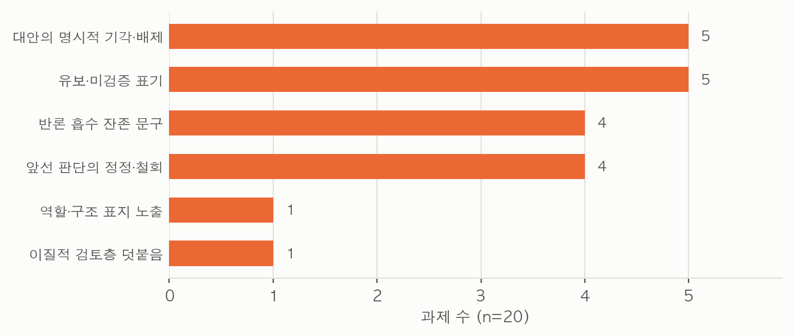
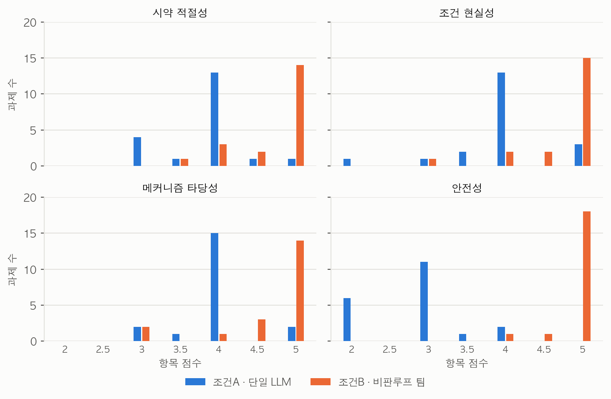
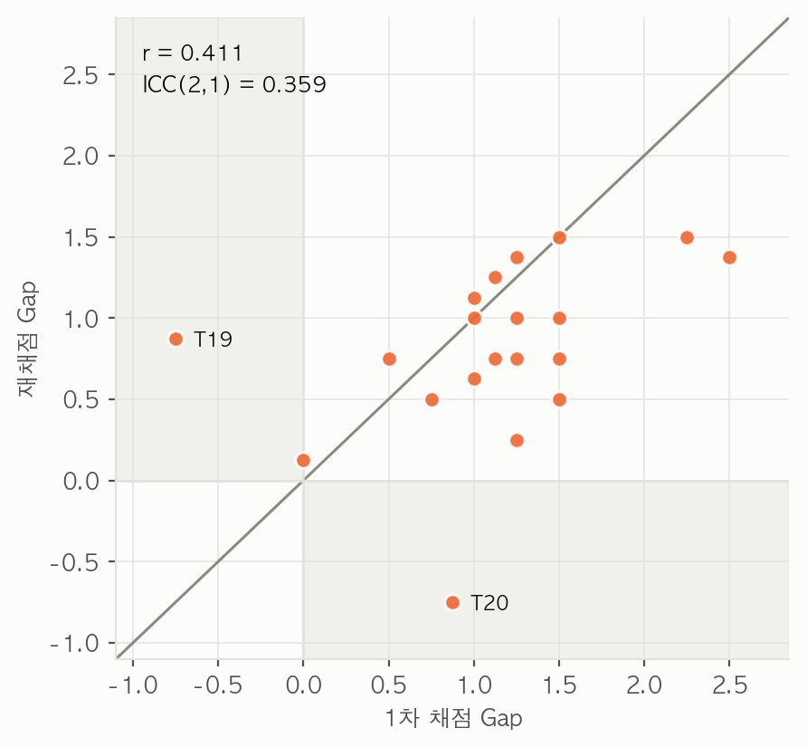
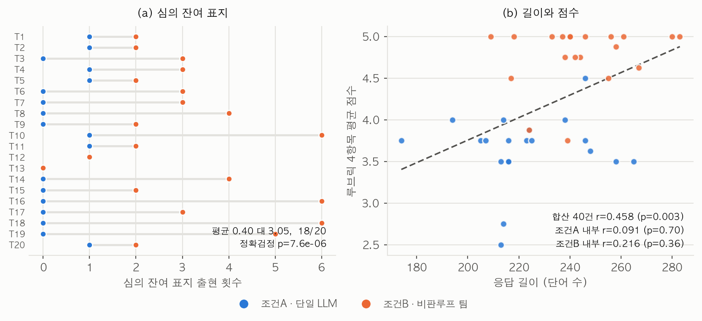
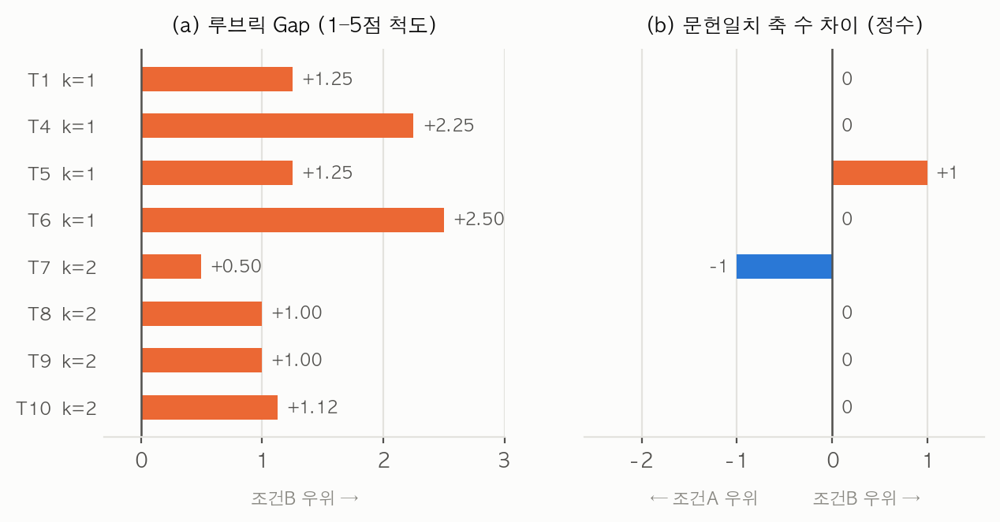

# 판정자는 설계의 품질을 재는가 심의의 흔적을 재는가: 조건민감 화학설계 과제 20건의 대조 실험

최호윤¹

¹연세대학교, 서울, 대한민국
교신저자: 최호윤
2026년 7월 31일

---

## 초록

대규모 언어모델을 전문가 에이전트로 나누고 비판 루프를 붙이면 단일 모델보다 나은 과학 설계를 얻는다는 보고가 축적되었다. 앵커 연구인 The Virtual Lab은 이 구조로 나노바디 후보를 설계해 웻랩 검증까지 통과시켰으나, "팀이 논의한다"는 조건 자체를 끄고 대조한 적은 없었다[1]. 우리는 그 조건 하나만 두 값을 갖는 조작변수로 바꾸어, 조건민감도로 층화한 화학설계 과제 20건을 단일 모델 1회 호출과 서로 다른 에이전트 7회 호출에 동일하게 투입하고 출처 라벨을 지운 뒤 채점했다. 루브릭 기준으로 팀은 20건 중 18건에서 앞섰고 효과크기 dz는 1.61이었다. 그러나 채점과 분리된 별도 호출에서 어느 쪽이 팀의 산출물인지만 물었을 때 판정자는 20건 전부를 맞혔고, 그 근거로 든 단서는 응답 길이가 아니라 비판과 정정과 보류라는 심의 과정의 잔여 흔적이었다. 점수 격차의 47%는 팀에만 배치된 안전 역할과 대응하는 루브릭 항목 한 곳에서 나왔으며, 정답이 문헌에 명확한 8과제에서 표준조건 일치도를 재면 두 조건의 차이가 관찰되지 않았다. 우리는 이로부터 웻랩 검증 없이 판정자 점수만으로 멀티에이전트 구조의 우월성을 주장하는 평가 설계에서는 구조의 효과와 구조가 텍스트에 남기는 흔적이 분리되지 않는다고 결론한다.

**주제어**: 멀티에이전트 시스템, LLM 판정자(LLM-as-a-judge), 평가 편향, 비판 루프, 화학 반응조건 설계, 조건민감도

---

## 1. 서론

### 1.1 배경

학제간 과학 연구는 한 사람이 필요한 모든 전문성을 갖추기 어렵다는 제약을 안고 있다. 합성 경로를 짜는 화학자, 전이상태를 따지는 메커니즘 전문가, 스케일업 위험을 평가하는 공정안전 전문가가 같은 문제를 함께 들여다볼 때 비로소 실행 가능한 설계가 나온다. 대규모 언어모델을 여러 전문가 페르소나로 분할하고 서로 비판하게 만드는 접근은 이 제약을 소프트웨어로 대체하려는 시도였다.

이 방향의 도구들은 각기 다른 지점에서 멈춰 있다. ChemCrow는 외부 화학 도구를 호출해 계산의 정확성을 확보했으나 도구가 답을 주지 못하는 설계 판단에서는 여전히 단일 모델의 추론에 의존했다[3]. Coscientist는 자동화 장비와 결합해 실제 반응을 수행했지만 장비가 없는 환경으로는 옮겨지지 않았다[4]. 생성형 에이전트 시뮬레이션 연구들은 다수 에이전트의 상호작용을 정교하게 재현했으나 산출물의 과학적 정확성 자체를 검증 대상으로 삼지 않았다[2]. 자기 비판을 통한 반복 개선이 단일 모델의 출력을 향상시킨다는 보고도 축적되었는데, 이 계열의 평가는 대부분 모델 자신 또는 다른 언어모델의 판정에 의존한다[6].

판정자를 언어모델로 두는 관행에는 알려진 함정이 있다. 판정자는 제시 순서에 따라 앞쪽을 선호하고, 더 긴 답을 더 좋은 답으로 읽으며, 자기 계열 모델의 출력을 선호하는 경향을 보인다[5]. 그러나 이 편향들이 멀티에이전트 구조를 평가할 때 어떻게 작동하는지는 별도로 다뤄지지 않았다. 멀티에이전트 파이프라인은 정의상 더 많은 단계를 거치고 그 과정을 최종 텍스트에 남기므로, 판정자가 그 흔적에 반응한다면 그 반응은 구조의 효과와 체계적으로 뒤섞인다.

### 1.2 앵커 연구와 그 빈틈

The Virtual Lab은 이 계열에서 가장 완결적인 형태를 보였다[1]. PI 에이전트가 전문가 팀을 구성하고, 세 종류의 회의를 거치며, 다섯 단계 워크플로우로 SARS-CoV-2 변이체를 겨냥한 나노바디 후보 92개를 설계했다. 설계된 후보는 웻랩에서 발현되고 결합했으며 인간의 직접 입력은 전체 과정의 1.3%에 불과했다. 멀티에이전트 팀이 실제로 작동하는 분자를 만들어냈다는 점에서 이 연구는 강한 증거를 제시했다.

그러나 앵커의 설계에는 검증되지 않은 지점이 하나 남는다. "팀이 비판 루프를 거쳐 논의한다"는 조건이 언제나 참으로 고정된 전제였고, 그 조건을 끄거나 단일 모델로 대체했을 때 산출물이 어떻게 달라지는지는 대조되지 않았다. 팀 구조가 성과의 원인이라는 주장은 그 구조를 제거한 대조군 없이 성립하지 않는다. 앵커의 웻랩 검증은 설계가 작동한다는 것을 입증했으나 팀이었기 때문에 작동했다는 것을 입증하지는 않았다.

### 1.3 우리의 기여

우리는 그 한 지점만 건드렸고, 세 가지를 기여한다.

1. 앵커가 고정 전제로 둔 "팀이 논의한다"를 두 값을 갖는 조작변수로 이분화하고, 에이전트 정의 형식과 회의 구조는 앵커의 것을 유지한 채 대조 실험을 수행했다.
2. 팀 조건을 단일 호출 내부의 역할연기가 아니라 서로 다른 에이전트 7회 호출로 실제 분리해 실행했다. 동일 주제의 선행 파일럿이 이 조건을 한 호출 안의 역할연기로 대체했던 결함을 제거하고 같은 질문을 다시 검증했다.
3. 판정자 점수만으로는 구조의 효과와 구조의 흔적을 분리할 수 없음을 서로 독립적인 네 경로에서 보였다. 채점과 분리된 조건 식별 검사, 채점 항목별 격차 분해, 재채점 신뢰도, 응답의 표면적 특성이 각각 다른 방식으로 같은 결론을 지지했다.

---

## 2. 비판루프 팀 아키텍처

우리는 에이전트 정의 형식과 회의 구조를 앵커에서 그대로 가져왔다. 새 아키텍처를 만들지 않은 것은 의도적이었다. 팀 조건이 앵커의 팀과 다르면 관찰된 차이가 팀 구조 때문인지 우리가 바꾼 부분 때문인지 구분할 수 없다. 앵커의 다섯 단계 워크플로우 가운데 팀 선택은 그대로 재사용하고, 나머지 네 단계는 대조 실험의 과제 명세·조건 설계·실행·평가로 치환했다.

모든 에이전트는 앵커와 동일하게 Title, Expertise, Goal, Role 네 요소로 정의했다.

| Title | Expertise | Goal | Role |
|---|---|---|---|
| PI | AI 보조 화학 연구 설계 총괄 | 팀 논의를 종합해 최종 설계를 확정한다 | 마지막 라운드에서 전체 논의를 통합한다 |
| 합성화학자 | 반응 경로와 시약 선택 | 실행 가능한 합성 조건을 제시한다 | 초안을 작성한다 |
| 반응메커니즘 전문가 | 전자이동과 전이상태 분석 | 메커니즘상 타당성을 확보한다 | 1차 비판을 반영해 개선안을 낸다 |
| 공정안전 전문가 | 실험실 안전성 및 스케일업 위험성 평가 | 안전상 결함을 제거한다 | 2차 비판을 반영해 최종 개선안을 낸다 |
| Scientific Critic | 과학적 추론에 대한 비판적 평가 | 오류와 누락과 위험을 지적한다 | 매 라운드마다 직전 산출물을 비판한다 |

**표 1. 본 연구에서 사용한 에이전트의 네 요소 정의.** 앵커의 정의 형식을 그대로 따랐다.

회의는 앵커가 정의한 세 종류 가운데 팀회의만 사용했다. 팀 조건은 4라운드 팀회의에 해당하며, 각 라운드는 전문가의 산출과 Critic의 비판으로 이루어지고 마지막 라운드에서 PI가 통합한다. 개별회의와 병렬회의는 우리 조작변수와 무관해 쓰지 않았다.

팀 구성에는 설계상의 비대칭이 하나 있다. 팀에는 공정안전 전문가가 배치되어 있으나 단일 모델 조건에는 그에 대응하는 장치가 없다. 이 비대칭은 앵커의 팀 구성을 그대로 재사용한 결과이며, 4.3절에서 그것이 결과에 미친 영향을 분리해 보고한다.

---

## 3. 방법

### 3.1 개요

우리는 앵커의 에이전트 정의와 팀회의 구조를 유지한 채 "팀이 논의한다"는 조건만 두 값으로 갈라, 과제 20건을 두 조건에 투입하고 익명화한 뒤 세 갈래로 평가했다(그림 1). 조건A는 단일 모델이 과제만을 입력으로 받아 한 번에 답하는 조건이고, 조건B는 초안·비판·개선·통합의 7회 분리 호출로 실행하는 조건이다. 그림 1의 (a)가 보여주듯 조건B의 최종 응답은 앞선 여섯 산출물을 프롬프트로 받아 생성되고 조건A는 과제만을 받으므로, 두 조건은 최종 응답을 만들 때 사용할 수 있는 정보량이 다르다.

응답 생성은 160회였다. 조건A 20회와 조건B 140회다. 평가는 68회로 1차 루브릭 채점 20회, 재채점 20회, 조건 식별 검사 20회, 문헌 표준조건 일치도 채점 8회다. 합계 228회이며 폐기분과 재실행분은 이 집계에 넣지 않았다(부록 C). 생성과 채점 모두 동일한 Claude 계열 모델을 사용했고 각 호출은 프롬프트만 입력으로 받는 독립 호출이었다. 정확한 모델 식별자와 표본추출 설정은 부록 C에 적었다.

평가는 세 경로다. 익명화된 응답 쌍에 대해 루브릭 4항목을 두 라운드에 걸쳐 채점했고, 채점과 완전히 분리된 호출에서 조건 식별 가능성만 따로 측정했으며, 정답이 문헌에 명확한 k=1~2 구간 8과제에 대해서는 판정자와 독립된 문헌 표준조건 일치도를 추가로 채점했다.

**그림 1. 실험 설계.** **(a)** 조건A는 과제만을 입력으로 받는 1회 호출이고(과제 20건, 호출 20회), 조건B는 초안·비판·개선·통합의 7회 분리 호출이다(호출 140회). 화살표는 각 호출이 프롬프트로 받은 선행 텍스트를 나타내며, ③과 ⑤는 직전 산출물과 그에 대한 비판 두 건을, ⑦ PI 통합 호출은 앞선 6건 전부를 받는다. **(b)** 두 조건의 최종 응답은 출처 라벨을 제거하고 제시 순서를 교대해 익명화한 뒤 세 경로로 평가했다. 문헌 표준조건 일치도(점선)는 k=1~2의 8과제에만 적용했다.

### 3.2 비교 조건 설계

조작변수는 두 값을 가졌다. 조건A는 동일한 과제를 토론이나 검토 없이 1회 프롬프트로 제시하고 응답 하나를 받았다. 프롬프트에는 혼자 최종 답을 제시하라는 지시를 명시했다. 조건B는 합성화학자의 초안, Critic의 1차 비판, 메커니즘 전문가의 개선안, Critic의 2차 비판, 공정안전 전문가의 최종 개선안, Critic의 3차 비판, PI의 최종 통합이라는 7회의 서로 다른 에이전트 호출로 실행했다. 한 호출 안에서 여러 역할을 연기하는 방식은 금지했다. 각 호출은 독립적이며 공유 상태가 없고, 선행 텍스트는 프롬프트로만 전달된다. 호출별 입력 구성은 부록 A에 있다.

두 조건의 응답 서식과 분량은 같은 지시문으로 통일하려 했다. 조건A의 단일 호출과 조건B의 PI 통합 호출에 동일한 형식 지시를 주어, 시약과 용매와 온도·시간과 work-up 절차와 핵심 근거라는 다섯 항목으로 200단어에서 300단어 사이로 쓰게 했다. 이 통일 시도가 실제로는 성공하지 못했음을 4.5절에서 보고한다.

### 3.3 과제 세트 구축

조절 변수의 수, 부반응 가능성, 문헌상 수율 분산을 기준으로 화학설계 과제의 조건민감도를 다섯 등급으로 나누었다. k=1은 조건이 표준화되어 교과서적 답이 존재하는 반응이고, k=5는 조건 하나만 바뀌어도 주생성물이 뒤집히는 경쟁 반응계다. 각 등급에 4건씩 배정해 20건을 구성했다. 등급은 저자 한 사람의 사전 판정이며 독립적인 검증을 받지 않았다.

| k | 과제 |
|---|---|
| 1 | T1 표준 환원적 아민화, T4 표준 피셔 에스터화, T5 표준 그리냐르 부가, T6 표준 윌리엄슨 에터화 |
| 2 | T7 선택적 모노-Boc 보호, T8 선택적 모노아세틸화, T9 케톤 선택적 환원, T10 모노브롬화 선택성 제어 |
| 3 | T2 화학선택적 환원, T11 선택적 에스터 가수분해, T12 에폭사이드 개환 위치선택성, T13 E-선택적 비티히 반응 |
| 4 | T14 프리델-크래프츠 파라선택성, T15 반마르코브니코프 하이드로보레이션, T16 SN1 대 SN2 용매 제어, T17 directed ortho-metalation 위치제어 |
| 5 | T3 분자내 딜스-알더 대 이량화 경쟁, T18 나자로프 고리화 torquoselectivity, T19 도미노 마이클-알돌 부분입체선택성, T20 옥시-코프 대 레트로-엔 경쟁 제어 |

**표 2. 조건민감도 등급별 과제 구성.** 과제 식별자는 이후의 그림과 표에서 동일하게 사용한다. 과제 프롬프트 전문은 부록 A에 있다.

과제는 모두 선행 파일럿과 겹치지 않게 새로 작성했고 반응 유형만 표준 유기화학 지식에 기반했다.

### 3.4 과제×조건 실행

과제 20건 전부를 두 조건에 동일하게 투입했다. 호출량 제약으로 실행은 등급별 4건씩 다섯 배치로 나누어 배치당 36회씩 수행했으며, 이 분할과 실패분 재실행이 사전에 계획한 제시 순서 교대를 흐트러뜨렸다. 실행 중 한 과제에서 초안 호출이 빈 값을 반환하고 그 값이 검증 없이 다음 비판 단계로 전달되어, 빈 초안을 비판하고 개선하는 체인이 완주하는 데이터 손상이 발생했다. 우리는 해당 과제를 폐기하고 각 호출 결과의 비어 있지 않음을 검사해 실패 시 그 과제를 재실행 대상으로 넘기도록 한 뒤 다시 실행했다. 최종 데이터셋 20건은 모두 이 검사를 통과한 완주 결과다. 실행 계보의 상세 수치는 부록 C에 있다.

### 3.5 평가 절차

#### 블라인드 익명화

과제별로 조건A의 응답과 조건B의 PI 통합 응답을 짝지은 뒤 출처 라벨을 지우고 제안1과 제안2로만 제시했다. 제시 순서는 과제마다 교대하도록 배정했다. 서식과 분량 통일은 이 단계의 블라인딩을 강화하기 위한 조치였다. 선행 파일럿에서 판정자가 문체와 분량만으로 팀 조건을 90% 알아맞혀 블라인딩이 사실상 무효화되었으므로, 우리는 그 원인을 실행 단계에서 미리 없애려 했다.

#### 조건 식별 검사

블라인딩이 유지되었는지를 순환 없이 재기 위해 별도의 검사를 두었다. 1차 채점에는 두 제안 중 어느 쪽이 더 숙고를 거친 것처럼 보이는지 묻는 문항이 딸려 있었으나, 그 문항은 조건을 묻지 않고 품질 인상을 물었으며 네 항목 점수와 같은 생성에서 나왔으므로 점수와 순환적이다.

이를 보완해 우리는 채점 문구를 완전히 제거한 자료를 새로 만들고, 판정자에게 과제와 두 익명 제안만 준 뒤 한 가지만 물었다. 둘 중 하나는 단일 모델이 한 번에 작성한 것이고 다른 하나는 서로 다른 전문가 에이전트들이 세 차례 비판과 수정을 거쳐 만든 것이라고 알려준 다음, 어느 쪽이 후자인지 지목하게 했다. 점수는 매기지 못하게 했고, 판단에 사용한 가장 결정적인 텍스트 단서 하나를 짧게 적게 했다. 과제별로 독립 판정자를 두어 20건을 병렬 실행했다.

#### 루브릭 채점

판정자에게 과제와 두 익명 제안을 주고 네 항목을 1점에서 5점 사이로 채점하게 했다. 항목은 시약 적절성, 조건 현실성, 메커니즘 타당성, 안전성이었다. 네 항목의 평균을 각 조건의 점수로 삼고, 조건B의 평균에서 조건A의 평균을 뺀 값을 과제별 Gap으로 정의했다. 관측된 점수 집합은 2, 3, 3.5, 4, 4.5, 5였고 항목 점수 160개 가운데 15개가 0.5점 간격이었으므로, 보고된 항목 평균과 Gap은 0.5점 간격을 포함한 척도 위에서 계산된 값이다.

루브릭의 안전성 항목은 조건B에만 존재하는 공정안전 전문가 역할과 직접 대응한다. 이 비대칭이 격차에 기여한 몫을 분리하기 위해 우리는 Gap을 네 항목으로 분해해 보고하고, 안전성을 제외한 세 항목만으로 Gap을 다시 계산해 동일한 검정을 반복하는 절차를 분석 계획에 포함했다.

#### 재채점

1차 채점이 판정자 1회 호출이었으므로 채점의 재현성을 알 수 없었다. 우리는 20건 전부를 다시 채점했다. 재채점은 1차와 동일한 블라인드 자료를 쓰고 제시 순서도 그대로 유지해, 두 라운드의 차이가 판정자 호출에서만 오도록 했다. 재채점자는 1차와 같은 계열의 모델이며 호출만 독립이다. 따라서 이 절차는 같은 모델을 두 번 물었을 때의 재현성을 재는 것이고, 모델 계열을 바꿨을 때의 재현성이나 모델 고유의 편향은 재지 못한다. 또한 제시 순서를 고정했으므로 이 절차로는 순서 효과를 검정할 수 없다.

#### 표면적 특성 측정

판정자가 내용의 정확성이 아니라 표면적 특성을 보았다는 설명은 측정 없이는 추측에 머문다. 우리는 세 가지를 재고 점수와의 관계를 확인했다. 첫째는 응답 길이로, 한글과 영숫자 토큰을 세어 단어 수로 삼았다. 둘째는 안전 관련 주제어의 출현 빈도로, 안전·위험·발열·폭발·인화·독성·환기·후드·보호구·장갑·고글·퀜칭·냉각·질소·불활성·MSDS·피부·흡입·폐기 열아홉 개 어휘의 등장 횟수를 합산했다. 셋째는 심의 잔여 표지로, 비판·반박·기각·철회·정정·보류·재확인·미검증·미해결·논쟁·게이트·대안·배제·폐기·채택하지 및 PI 종합·PI 최종·종합하면을 합산했다. 세 번째 지표는 조건 식별 검사의 판정자들이 실제로 든 단서를 사후에 어휘화한 것이다.

길이와 점수의 관계를 볼 때는 두 조건을 합산한 상관과 조건 내부 상관을 함께 계산했다. 합산 상관은 조건B가 더 길고 동시에 더 높은 점수를 받았다는 사실만으로도 양수가 되므로, 설명하려는 격차 자체에 의해 기계적으로 만들어질 수 있다. 조건 내부 상관은 그 교란을 받지 않는다. 두 번째와 세 번째 지표는 서술의 질이 아니라 양을 재는 거친 대리지표다.

#### 문헌 표준조건 일치도

실험실이 없어 설계된 조건으로 실제 합성을 시도할 수 없다는 제약이 있었다. 이 제약을 없애지는 못하지만 정답이 문헌에 명확한 구간에서는 판정자와 독립된 객관 지표를 얹을 수 있었다.

k=1과 k=2의 8건에 한해 문헌 표준조건 일치도를 채점했다. k=3 이상은 문헌상 정답이 하나로 정해지지 않아 적용하지 않았다. 객관성을 확보하기 위해 판정 이전에 과제별 표준조건을 네 개 축으로 명문화했다. 축의 구성은 과제 성격에 따라 달랐다. 표준 반응에서는 시약·촉매, 용매, 온도, 선택성 근거를 축으로 삼았고, 통계적 선택성이 지배하는 과제에서는 당량, 적가·희석 방식, 용매·촉매, 한계 인식을 축으로 삼았다. 채점자는 사전 확정된 기준만 사용해 각 축을 일치 1점과 불일치 0점으로 판정했고 축을 누락한 경우도 불일치로 처리했다. 조건 라벨을 지운 파일만 제공하고 다른 자료 열람을 금지했으며, 제시 순서는 루브릭 채점과 같게 두어 두 지표를 같은 조건에서 비교할 수 있게 했다.

채점 이후 화학 검토에서 기준 두 건의 오류가 확인되어 정정하고 재채점했다. 하나는 대칭 다이올의 모노아세틸화에서 아세트산 무수물 당량 기준을 0.9에서 1.0당량으로 좁혀 놓은 것이다. 이 반응의 선택성은 통계적으로 결정되므로 당량을 낮출수록 모노 대 다이 비가 개선된다. 각 하이드록시기의 아실화를 독립 사건으로 보는 이항 모델로 계산하면 0.3당량에서 약 11대 1이고 1.0당량에서 약 2대 1이므로, 저당량은 결함이 아니라 표준 전략이다[12]. 다른 하나는 다이아민의 모노-Boc 보호에서 허용 용매를 염화메틸렌계로만 열거한 것으로, Boc2O 아민 보호에서는 테트라하이드로퓨란과 물의 이상계나 메탄올도 통용 매질이다[12]. 두 정정의 영향은 결과에서 정정 전후 값을 함께 적어 보고한다.

### 3.6 통계 분석

우리는 검정을 실행하기 전에 다음을 정했다. 사전 지정 가설은 과제별 Gap의 중앙값이 0보다 크다는 것 하나이며, 대응표본 Wilcoxon signed-rank 검정으로 판정하고 유의수준은 양측 0.05로 두었다[8]. 조건민감도 등급에 따른 격차 변화는 사후 탐색 분석으로 다룬다. 원래는 이를 사전 지정 가설로 두고 회귀 기울기가 유의하게 양수일 때만 지지하는 반증 기준을 걸었으나, 4.6절에 보고하는 조작 점검 실패와 프롬프트 설계상의 교란 때문에 가설 검정으로 판정하기에 부적합하다고 판단해 탐색 분석으로 옮겼다.

효과크기는 Cohen's dz로 보고하고[9], 평균 Gap과 dz와 회귀 기울기에는 부트스트랩 백분위 95% 신뢰구간을 붙였다[11]. 재표본 2만 회, 난수 시드 20260731을 사용했다. Wilcoxon 검정은 동점이 없으면 정확검정을, 동점이 있으면 정규근사를 본문 수치로 삼고 동점 제외 정확검정 값을 함께 적었다. 다중검정 보정은 적용하지 않았다. 사전 지정 검정이 한 건이라 영향은 제한적이나 사후 분석을 포함하면 검정 수가 늘어나므로, 경계선에 있는 p값은 보정 없이 읽어야 한다. 조건 식별 검사, 항목별 분해, 재채점, 표면적 특성 측정은 1차 결과를 본 뒤에 계획한 사후 분석이며 사전 지정 가설의 판정에 쓰지 않았다.

---

## 4. 결과

### 4.1 조건 식별 검사

채점과 분리된 별도 호출에서 어느 쪽이 멀티에이전트 산출물인지만 물었을 때, 판정자는 20건 전부를 맞혔다. 무작위 추측을 귀무가설로 한 이항검정의 p값은 1.9×10⁻⁶이었고, 20건 모두 확신도를 높음으로 보고했다. 1차 채점에 딸려 있던 더 숙고돼 보이는 쪽 지목과도 20건 전부에서 일치했다.

판정자가 든 결정적 단서는 길이나 상세함이 아니었다. 우리는 20건의 단서 서술을 배타적 1차 범주로 부호화했다(그림 2). 대안을 명시적으로 기각하거나 배제한 흔적이 5건, 판단을 유보하거나 근거가 미검증이라고 표시한 흔적이 5건, 앞선 판단을 정정하거나 철회한 흔적이 4건, 반론을 흡수한 잔존 문구가 4건이었다. 나머지 2건은 역할·구조 표지가 그대로 남은 경우와 안전·폐액·규제 같은 이질적 검토층이 덧붙은 경우였다. 부호화는 저자 단독 판단이며 독립 부호화자 확인을 받지 않았다.

단서 원문을 그대로 옮기면 다음과 같다. 한 판정자는 최종 응답에 남은 "PI 종합" 표제와 기각된 대안의 사유를 들었고, 다른 판정자는 자기 논거를 미검증 가설로 철회하고 재정당화한 흔적을 들었으며, 또 다른 판정자는 이전 초안 조항을 참조하는 표기와 옵션 보류 결정을 들었다. 이 단서가 텍스트에 실제로 대응하는지는 4.5절에서 확인했다.

이 결과는 우리의 개선 시도와 어긋난다. 서식과 분량 통일은 선행 파일럿의 90% 식별률을 낮추려는 조치였으나 식별률은 100%였다. 다만 20건 중 20건과 50건 중 45건의 차이는 통계적으로 구별되지 않으며 Fisher 정확검정의 p값은 0.31이다. 또한 두 측정은 서로 다른 질문을 썼으므로, 정확한 서술은 통일이 식별률을 낮추지 못했다는 것이다.

**그림 2. 조건 식별에 사용된 단서의 범주.** 판정자 20명이 각각 지목한 결정적 단서 하나를 배타적 1차 범주로 부호화했다(n=20). 막대는 범주별 과제 수다.

### 4.2 루브릭 점수 비교와 H1 검정

루브릭 채점에서 팀은 20건 중 18건에서 단일 모델을 앞섰고 동점이 1건, 단일 모델이 앞선 경우가 1건이었다(그림 3). 조건A의 평균 점수는 3.650이고 표준편차는 0.427이었으며, 조건B는 평균 4.769에 표준편차 0.370이었다. 평균 Gap은 1.119이고 95% 신뢰구간은 0.812에서 1.406이었다. 동점 1건이 있어 Wilcoxon 정규근사를 본문 수치로 삼으면 검정통계량 2.5에 p값 1.9×10⁻⁴이고, 동점을 제외한 정확검정에서는 1.9×10⁻⁵였다. 효과크기 dz는 1.61이고 신뢰구간은 0.962에서 3.329였다. 유의수준 0.05에서 사전 지정 가설은 지지되었다.

제시 순서는 조건B가 먼저 놓인 경우가 12건, 조건A가 먼저인 경우가 8건이었다. 배치 분할과 실패분 재실행 과정에서 교대 배정이 흐트러져 균형이 깨졌다. 조건B 선행 집단의 평균 Gap은 1.198, 조건A 선행 집단은 1.000이었고 Mann-Whitney 검정의 p값은 0.41이었다. 이 검정으로는 순서 효과의 유무를 판정할 수 없다. 표본이 12건과 8건으로 불균형하고 작아 검정력이 낮으며, 점 추정의 방향은 앞에 놓인 쪽이 유리하다는 예측과 같다.

**그림 3. 과제별 루브릭 점수의 조건 간 이동.** 과제 20건을 조건민감도 등급 k로 묶어 정렬했다. 각 행에서 왼쪽 점은 조건A, 오른쪽 점은 조건B의 루브릭 4항목 평균이다(1–5점 척도, 관측값에 0.5점 간격 15개 포함). 두 점을 잇는 선의 길이가 해당 과제의 Gap이며, 가로 점선은 등급 경계다. T18은 두 조건이 동점이어서 점을 위아래로 갈라 표시했다.

### 4.3 격차의 구성

| 항목 | 조건A | 조건B | 차이 | 차이의 비중 | Wilcoxon p |
|---|---|---|---|---|---|
| 시약 적절성 | 3.850 | 4.725 | +0.875 | 19.6% | 0.0019 (근사, 동점 2건) |
| 조건 현실성 | 3.950 | 4.750 | +0.800 | 17.9% | 0.0094 (정확) |
| 메커니즘 타당성 | 3.975 | 4.675 | +0.700 | 15.6% | 0.012 (정확) |
| 안전성 | 2.825 | 4.925 | +2.100 | 46.9% | 1.0×10⁻⁴ (근사, 동점 1건) |

**표 3. 루브릭 항목별 조건 간 평균 점수와 차이.** 비중은 네 항목 차이의 합 4.475에 대한 몫이다.

안전성의 차이는 단일 항목으로 가장 크고 네 항목 차이 합의 46.9%를 차지한다. 과반은 아니므로 격차가 이 항목 하나에서 나왔다고 말할 수는 없다. 분포를 보면 편중의 성격이 드러난다(그림 4). 조건A의 안전성 점수는 20건 중 17건이 2점 또는 3점이고 조건B는 18건이 5점으로, 이 항목은 두 조건 사이에서 거의 이분화되어 있다. 나머지 세 항목에서는 조건A가 4점, 조건B가 5점 부근에 모여 완만한 차이를 보인다. 2절에서 밝힌 설계 비대칭이 이 결과의 직접적 원인으로 보인다.

안전성을 뺀 세 항목으로 Gap을 다시 계산하고 같은 검정을 반복했다. 평균 Gap은 0.792이고 신뢰구간은 0.400에서 1.142였다. 조건B 우위가 17건, 동점이 1건, 조건A 우위가 2건이었다. Wilcoxon 정규근사 p값은 0.0057이고 dz는 0.906으로 신뢰구간은 0.362에서 2.625였다. 결론은 유지되지만 효과크기가 1.61에서 0.906으로 내려간다. 안전성 항목의 비대칭은 격차의 크기를 부풀렸으나 격차의 존재를 만들어내지는 않았다.

**그림 4. 루브릭 항목별 점수 분포.** 각 패널은 항목 하나의 점수 분포이며 파랑은 조건A, 주황은 조건B다(각 n=20, 1–5점 척도, 0.5점 간격 포함). 안전성 항목에서 조건A는 17건이 2점 또는 3점이고 조건B는 18건이 5점이다.

### 4.4 채점의 재현성

20건 전부를 같은 계열 모델의 독립 호출로 다시 채점했다. 방향에 관한 결론은 재현되었다. 재채점에서 조건B 우위는 19건, 조건A 우위는 1건이었고 동점이 없어 정확검정을 적용해 p값은 4.8×10⁻⁵였다. 평균 Gap은 0.8125이고 dz는 1.517이었다. 항목별 편중도 그대로여서 안전성 차이는 1.925였고 나머지 세 항목은 0.400에서 0.500 사이였다. 조건 식별도 완벽하게 재현되었다. 재채점에서도 판정자는 20건 전부에서 조건B를 더 숙고된 쪽으로 지목했고 두 라운드가 지목한 대상은 20건 모두 같았다.

크기에 관한 결론은 재현되지 않았다(그림 5). 과제 수준 Gap의 두 라운드 상관은 0.411이고 p값은 0.072로 유의하지 않았으며 ICC(2,1)은 0.359에 그쳤다[10]. 항목 수준에서 두 라운드가 정확히 같은 점수를 준 비율은 28.1%였고 1점 이내로 일치한 비율은 95.0%였으며 항목 수준 ICC는 0.703이었다. 20건 중 2건은 부호까지 뒤집혔다. T19는 1차에서 −0.750이었다가 재채점에서 +0.875가 되었고 T20은 +0.875에서 −0.750으로 바뀌었다.

이 대비가 이 절의 요점이다. 같은 모델은 어느 쪽이 팀인지는 흔들림 없이 알아보았고 그 팀이 얼마나 더 나은지는 일관되게 답하지 못했다. 이 절차는 모델 계열을 바꾸지 않았으므로 판정자를 실제로 교체했을 때의 재현성은 여전히 미지다.

**그림 5. 1차 채점과 재채점의 과제별 Gap.** 가로축은 1차 채점, 세로축은 같은 계열 모델의 독립 호출로 수행한 재채점의 Gap이다(n=20, 단위는 루브릭 4항목 평균 점수 차이). 대각선은 두 라운드가 완전히 일치하는 선이고 음영 영역은 두 라운드의 부호가 다른 사분면이다. T19와 T20은 부호가 뒤집힌 두 과제다.

### 4.5 응답의 표면적 특성

조건 식별 검사의 판정자들이 지목한 단서가 텍스트에 실제로 대응했다(그림 6a). 심의 잔여 표지는 조건A에서 평균 0.40회, 조건B에서 평균 3.05회 등장했고 20건 중 18건에서 조건B가 많았으며 동점이 2건이었다. 동점을 제외한 정확검정의 p값은 7.6×10⁻⁶다. 또한 조건B의 최종 응답 한 건에는 PI라는 역할명이 그대로 남아 있었다. 형식 지시로 서식을 통일했음에도 비판과 수정의 이력이 최종 텍스트에서 지워지지 않았다.

길이에 관해서는 결과가 달랐다. 조건A의 응답은 평균 222.8단어였고 조건B는 244.3단어로 차이는 평균 21.6단어이며 20건 중 13건에서 조건B가 길었다. 동점 1건이 있어 정규근사 p값은 0.0079이고 동점 제외 정확검정 p값은 0.0062다. 즉 분량 통일은 성공하지 못했다. 형식 지시를 어긴 응답도 있어 조건A의 두 건이 200단어 하한을 밑돌아 각각 174단어와 194단어였다.

그러나 길이가 점수를 만들었다는 설명은 이 자료로 지지되지 않는다(그림 6b). 응답 40건을 합산하면 길이와 점수의 상관은 0.458에 p값 0.0030으로 유의하지만, 이 상관은 조건B가 더 길고 동시에 더 높은 점수를 받았다는 사실만으로 생긴다. 조건 내부로 들어가면 상관이 사라진다. 조건A 내부는 0.091에 p값 0.70이고 조건B 내부는 0.216에 p값 0.36이다. 합산 회귀의 기울기는 단어당 0.0135점이므로 관측된 21.6단어 차이는 0.292점을 예측하며 이는 실제 격차 1.119의 26.1%에 그친다. 과제 내부에서 길이 차이와 Gap의 상관도 유의하지 않았다. 상관계수는 0.384에 p값 0.094였고 Spearman 상관은 0.252에 p값 0.28이었다.

안전 관련 주제어는 조건A에서 평균 1.3회, 조건B에서 평균 5.8회 등장했고 20건 중 19건에서 조건B가 많았다. 동점 제외 정확검정의 p값은 3.8×10⁻⁶다. 다만 이 지표는 서술의 양만 재므로 팀의 안전 서술이 더 타당했는지 아니면 더 많았을 뿐인지는 구별하지 못한다.

**그림 6. 응답의 표면적 특성.** **(a)** 과제별 심의 잔여 표지 출현 횟수다. 왼쪽 점은 조건A, 오른쪽 점은 조건B이며 20건 중 18건에서 조건B가 많았다. **(b)** 응답 길이와 루브릭 평균 점수의 관계다. 점선은 응답 40건 전체에 대한 적합이고 그림 안에 조건 내부 상관을 함께 적었다. 합산 상관은 유의하지만 조건 내부에서는 사라진다.

### 4.6 조건민감도와 격차 (탐색적 분석)

Gap을 조건민감도 등급 k에 회귀한 기울기는 −0.266이고 95% 신뢰구간은 −0.464에서 −0.038이었다. 상관계수는 −0.554, p값은 0.011이다. 과제를 하나씩 빼고 20회 재적합했을 때 기울기는 −0.290에서 −0.187 사이에 머물고 p값은 항상 0.05 미만이었으므로 이 부호는 특정 과제 하나에 기인하지 않는다. 방향은 예상과 반대다. 조건민감도가 높은 과제일수록 격차가 커지지 않고 오히려 줄었다.

이 관계를 등급이 오를 때마다 격차가 줄어드는 용량-반응 관계로 읽어서는 안 된다. 세 가지 이유가 있다. 첫째, 등급별 평균은 단조가 아니다. k=2의 평균 0.906이 k=3의 1.281과 k=4의 1.312보다 낮다. 둘째, 순위 기반 Spearman 상관은 −0.439에 p값 0.053으로 유의수준을 넘지 못했다. 안전성을 제외한 세 항목으로 계산하면 −0.492에 p값 0.028로 유의하다. 셋째, k=1~2를 k=4~5와 묶어 비교하면 평균 1.359 대 0.797이지만 Mann-Whitney 검정의 p값은 0.32로 유의하지 않다. 즉 선형회귀에서는 음의 기울기가 관찰되지만 순위 검정과 거친 대비에서는 그 신호가 유지되지 않는다.

| k | 과제 수 | 평균 Gap (4항목) | 평균 Gap (3항목) |
|---|---|---|---|
| 1 | 4 | 1.812 | 1.583 |
| 2 | 4 | 0.906 | 0.625 |
| 3 | 4 | 1.281 | 1.000 |
| 4 | 4 | 1.312 | 1.083 |
| 5 | 4 | 0.281 | −0.333 |

**표 4. 조건민감도 등급별 평균 Gap.** k=5의 세 항목 평균이 음수인 것은 T19 한 과제에 의존하며, T19를 빼면 이 값은 +0.111이 된다. T19는 4.4절에서 두 채점 라운드 사이에 부호가 뒤집힌 두 과제 중 하나다.

이 분석을 사전 지정 가설에서 사후 탐색으로 옮긴 근거는 조작 점검의 실패다. 절대 점수를 k에 회귀하면 조건A는 오히려 상승하고 조건B는 하강한다. 조건A는 상관 0.447에 p값 0.048이고 k=1 평균 3.188에서 k=5 평균 3.938로 올라갔으며 조건B는 상관 −0.527에 p값 0.017이었다. 판정자가 단일 모델의 답을 교과서적 반응보다 경쟁 반응계에서 더 높게 평가했다는 뜻이므로, 등급이 루브릭이 재는 것을 따라가지 못하거나 루브릭이 화학적 난이도를 따라가지 못한다. 여기에 더해 k=3 이상의 과제 프롬프트는 조작해야 할 변수를 본문에 명시한 경우가 많고 과제 형식도 조건을 설계하라는 요구에서 어떻게 달라지는지 설명하라는 요구로 바뀐다. 두 교란이 모두 k와 상관되므로 이 관계를 가설 검정 결과로 보고하는 것은 부적합하다.

### 4.7 문헌 표준조건 일치도

k=1과 k=2의 8건에서 문헌 표준조건 일치도를 채점한 결과, 기준 정정을 반영한 값으로 조건A는 32점 만점에 31점이고 조건B도 31점이었다. 평균 일치도 격차는 0.000이다. 조건B가 앞선 경우가 1건, 동점이 6건, 조건A가 앞선 경우가 1건이었다. 정정 이전 값은 조건A 30점과 조건B 29점으로 격차가 −0.125였으므로 두 기준 오류를 고치면 격차의 부호가 사라지고 크기가 줄어든다. 어느 값을 쓰더라도 이 지표에서 조건B의 우위는 관찰되지 않는다.

이 결과를 두 조건이 동등하다는 뜻으로 읽어서는 안 된다. 8건 중 6건이 동점이어서 비교 가능한 쌍이 2건뿐이고 검정력이 없다. 정확한 서술은 이 지표에서 두 조건의 차이가 관찰되지 않았다는 것이며 차이의 부재가 입증된 것은 아니다. 대조를 위해 적으면 같은 8건의 루브릭 Gap 평균은 1.359였고 조건B가 8건 전부에서 앞섰다(그림 7).

불일치가 남은 두 과제의 내용은 다음과 같다. 그리냐르 부가에서는 조건A가 시약 당량을 제시하지 않아 한 축을 잃었다. 모노-Boc 보호에서는 조건B가 과제 프롬프트가 지정한 다이아민 대과량 전략 대신 모노양성자화 후 Boc 시약 1당량을 쓰는 경로를 택해 당량 전략 축을 잃었다. 이 경로 자체는 문헌에 있는 방법이지만 프롬프트가 요구한 전략이 아니었고, 조건B가 스스로 보고한 선택성 상한도 대과량법보다 낮았다.

**그림 7. 같은 8과제에 대한 두 지표의 비교.** k=1~2의 8과제만 대상이다(n=8). **(a)** 루브릭 Gap(조건B 평균 − 조건A 평균, 1–5점 척도)으로 8건 전부 조건B가 앞선다. **(b)** 문헌 표준조건 일치 축 수의 차이(네 축 중 일치 개수, 정수)로 6건이 동점이고 나머지는 서로 반대 방향이다. 두 패널의 단위가 다르므로 막대 길이를 직접 비교할 수 없다. (b)는 사후 발견된 기준 오류 두 건을 정정한 뒤의 값이다.

---

## 5. 논의

### 5.1 지지되는 기제와 기각된 기제

지지되는 기제는 심의 흔적의 식별이다. 팀의 최종 응답에는 대안을 기각했다는 서술, 앞선 판단을 정정하거나 보류했다는 표현, 근거를 스스로 유보한 문장이 남았고 그 표지는 조건A보다 일곱 배 이상 자주 등장했다. 채점과 분리된 호출의 판정자들은 정확히 그 표지를 단서로 들어 20건 전부를 맞혔다. 서식을 통일해도 이 흔적은 지워지지 않았으며 한 건에서는 역할명 자체가 남았다.

기각된 기제는 장문 선호다. 팀의 응답이 유의하게 길기는 했으나 길이와 점수의 상관은 조건 내부에서 사라졌고 합산 상관의 기울기로는 관측 격차의 4분의 1만 설명된다. 우리 자료에서 장문 선호는 격차의 주된 원인이 아니며, 초록과 종합 주장에서 이 기제를 주장하지 않은 이유가 여기에 있다.

### 5.2 배제되지 않은 대안 설명

관찰된 격차에는 세 가지 대안 설명이 남아 있다. 우리 설계는 이들을 서로 구분하도록 만들어지지 않았으므로, 각 설명 아래에 그것을 분리하는 데 필요한 측정을 함께 적는다.

첫째는 자기 선호 편향이다. 판정자는 응답을 생성한 모델과 같은 계열이므로 자기 계열의 반복 정제를 거친 텍스트를 선호했을 수 있다. 다만 자기 선호는 같은 계열 텍스트 전반을 선호하게 만들 뿐, 심의 표지가 많은 쪽을 특정해 지목하게 만들지는 않으므로 20건 전부의 식별을 대체 설명하지는 못한다. 이 설명을 분리하려면 다른 계열 모델 판정자로 동일한 블라인드 자료를 재채점하면 되고, 이는 새 생성 없이 20회 호출로 가능하다.

둘째는 제시 순서 편향이다. 4.2절의 순서 검정은 12대 8 불균형으로 검정력이 부족하고, 재채점은 순서를 고정했으므로 이 문제를 보완하지 못한다. 균형 잡힌 순서 배정으로 채점을 한 라운드 더 돌리면 분리된다.

셋째는 고난도 구간에서 과제 프롬프트가 정답을 노출한 교란이다. 4.6절에 적은 대로 k=3 이상의 프롬프트는 조작할 변수를 명시했다. 프롬프트의 정답 노출 여부를 이진 부호화해 노출되지 않은 부분집합에서 분석을 재적합하면 이 교란의 크기를 잴 수 있다.

넷째 가능성은 대안 설명이 아니라 우리 주장이 애초에 배제하지 않는 것이다. 팀이 실제로 더 나은 설계를 산출했을 수 있고, 특히 안전성 항목에서는 이 해석이 강하다. 공정안전 전문가를 넣었더니 설계가 실제로 더 안전해졌고 루브릭이 그 실질적 개선을 옳게 잡아냈다는 해석은, 우리가 안전 서술의 양만 재고 타당성을 재지 않았으므로 배제할 수 없다. 화학 전공자가 스무 쌍의 안전 서술의 타당성을 블라인드로 채점하면 이 몫을 분리할 수 있다.

### 5.3 한계

우리 결론을 사용하는 방식을 바꾸는 한계가 다섯 가지 있다.

첫째, 실험실이 없어 설계된 조건으로 실제 합성을 시도할 수 없었으므로 우리가 측정한 것은 설계의 논리적 타당성이며 합성 성공률이 아니다. 다만 이 제약은 정답이 문헌에 명확한 구간에서 독립 지표를 얹는 방식으로 부분적으로 보강할 수 있었고, 4.7절이 그 결과다. 둘째, 응답을 생성한 모델과 채점한 판정자가 모두 같은 계열이므로 자기 선호 편향을 검사할 수 없었다. 이는 다른 계열 판정자로 같은 자료를 재채점하면 곧바로 검증되며 새 생성이 필요하지 않다. 셋째, 루브릭의 안전성 항목이 팀의 역할 구성과 대응해 격차를 부풀렸고, 우리는 안전 서술의 양만 재고 타당성을 재지 않았으므로 이 편중이 평가의 인공물인지 팀의 실질적 개선인지 가르지 못했다. 안전성을 제외한 강건성 결과를 함께 보고한 것이 현재의 대응이다. 넷째, 과제 수준 Gap의 재현성이 낮아 ICC가 0.359였고 두 건은 부호가 뒤집혔다. 따라서 개별 과제의 Gap 순위를 근거로 삼는 해석은 하지 않았으며, 등급 회귀와 표 4의 등급별 평균은 이 낮은 재현성을 안고 읽어야 한다. 판정 라운드를 세 번 이상으로 늘려 Gap을 평균화하면 개선된다. 다섯째, 조건민감도 등급이 저자 한 사람의 사전 판정이고 조작 점검이 실패했다. 우리가 이 분석을 가설 검정에서 사후 탐색으로 옮긴 이유이며, 독립 채점자의 등급 확인과 정답을 노출하지 않는 프롬프트로 다시 실행하면 가설로 되돌릴 수 있다.

과제 서술 자체의 결함도 밝혀 둔다. 세 과제가 성립하지 않는 전제를 담고 있다. 프리델-크래프츠 아실화 과제는 다이아실화 억제를 요구했으나 아실화는 생성물이 고리를 비활성화해 자기제한적이므로 그 부반응은 문제가 되지 않는다. 나자로프 고리화 과제는 컨로테이토리 폐환의 입체특이성이 루이스산 세기에 따라 달라지는지를 물었으나 그 회전 방향은 궤도 대칭이 정하며 루이스산이 바꿀 수 있는 것은 두 컨로테이토리 모드 사이의 분기다. 옥시-코프 과제는 레트로-엔 경쟁을 전제했으나 알콕사이드 조건에서는 그 경로에 필요한 수산기 수소가 없어 경쟁이 억제된다. 세 과제는 모두 k=4~5 구간에 있어 등급별 탐색 분석에 영향을 주며, 교체 후 재실행이 필요하다.

측정 절차에 남은 제약도 셋 있다. 문헌 일치도 기준을 실행 전에 화학 검토받지 않아 사후에 오류 두 건을 발견했고, 이 기준은 축을 독립적으로 채점하므로 시약과 용매가 서로 양립하지 않는 조합도 만점을 받을 수 있다. 채점 척도는 정수로 설계했으나 스키마가 이를 강제하지 않아 항목 점수 160개 중 15개가 반점이었다. 표본이 20건이므로 순위 검정과 길이 관련 상관이 경계선이나 무의미에 머문 것은 검정력 부족과 구분되지 않는다.

### 5.4 방법론적 기여와 권고

우리의 기여는 판정자 점수만으로는 구조의 효과와 구조의 흔적을 분리할 수 없음을 네 갈래 측정으로 구체적으로 보인 것이다. 이는 팀 구조의 우월성을 확인하거나 부정하는 주장과는 다른 층위에 있다.

멀티에이전트 연구에서 웻랩 검증은 비용이 크므로 판정자 채점이 흔히 대체 수단으로 쓰인다. 우리 결과는 그 대체가 안전하지 않을 수 있음을 시사한다. 판정자는 조건을 완벽하게 식별할 수 있었고, 그 식별의 단서는 파이프라인이 텍스트에 남긴 흔적이었으며, 루브릭 항목 하나는 한 조건에만 있는 역할과 대응했고, 점수의 크기는 같은 모델을 두 번 물어도 재현되지 않았다.

여기서 다섯 가지 권고가 나온다. 첫째, 조건 식별 가능성을 채점과 분리된 별도 호출에서 직접 측정해 보고한다. 채점에 딸린 인상 문항은 점수와 순환하므로 블라인딩의 증거가 되지 못한다. 둘째, 파이프라인이 남기는 흔적을 제거하거나 최소한 정량화한다. 서식 통일만으로는 지워지지 않는다. 셋째, 루브릭 항목이 특정 조건의 역할 구성과 대응하는지 점검하고 대응하는 항목을 제외한 강건성 결과를 함께 보고한다. 넷째, 판정자를 두 번 이상 투입해 방향과 크기의 재현성을 나눠 보고하되 판정자는 서로 다른 모델 계열이어야 한다. 같은 계열의 반복 호출은 재현성의 상한만 보여준다. 다섯째, 정답이 알려진 부분집합에서라도 판정자와 독립된 객관 지표를 함께 재고, 그 지표의 채점 기준도 실행 전에 해당 분야 검토를 받는다.

### 5.5 종합 주장과 전망

판정자 루브릭으로 측정한 비판루프 멀티에이전트 팀의 우위는 평가 방법과 분리되지 않는다. 판정자는 채점과 무관한 별도 질문에서도 어느 쪽이 팀 산출물인지 20건 전부 식별했고, 그 단서는 응답 길이가 아니라 비판과 정정과 보류라는 심의 과정의 잔여 흔적이었으며 그 흔적은 팀 응답에 실제로 유의하게 많았다. 점수 격차의 47%는 팀에만 안전 역할을 배치한 설계 비대칭에서 나왔고, 격차의 크기는 같은 모델의 독립 호출로 재채점하면 재현되지 않았으며, 정답이 알려진 구간에서 문헌 표준조건 일치도를 재면 차이가 관찰되지 않았다. 따라서 웻랩 검증 없이 판정자 점수만으로 멀티에이전트 구조의 우월성을 주장하는 평가 설계에서는 구조가 텍스트에 남기는 흔적과 구조의 실제 효과가 분리되지 않는다. 이 결론은 팀의 우위가 허구라는 뜻이 아니다. 안전성을 제외한 강건성 검정에서도 재채점에서도 방향은 유지되었고, 팀이 실제로 더 나은 설계를 냈을 가능성은 배제되지 않는다. 우리가 보인 것은 두 가능성이 현재의 평가 설계로 나뉘지 않는다는 것이다.

이 기제는 세 조건이 갖춰진 곳에서 나타날 수 있다. 판정자가 조건을 식별할 수 있고, 루브릭 항목이 한 조건에만 있는 역할과 대응하며, 산출물의 정확성을 독립적으로 확인할 수단이 없는 경우다. 실험 설계나 정책 문서 작성처럼 실행 결과를 즉시 확인할 수 없는 산출물의 평가가 여기에 가깝다. 반면 코드 생성은 실행 가능한 테스트가 객관적 정답을 주므로 세 번째 조건이 성립하지 않는다. 이 확장은 한 영역과 한 모델 계열과 저자가 작성한 20건에서 얻은 결과에 대한 예측이며 검정된 결과가 아니다.

가장 유력한 후속 실험은 두 가지다. 하나는 심의 잔여 표지를 지운 응답으로 다시 채점해 격차가 얼마나 남는지 재는 것이고, 다른 하나는 화학 전공자의 블라인드 채점을 판정자 점수와 대조하는 것이다. 앞의 실험은 흔적의 기여분을 직접 추정하고, 뒤의 실험은 판정자 점수가 사람의 판단과 어디서 갈리는지 보여줄 것이다. 우리는 판정자 기반 평가를 폐기하자고 주장하지 않는다. 그 점수가 무엇을 재고 있는지 함께 측정하지 않으면 구조의 효과로 읽을 수 없다고 주장한다.

---

## 데이터 가용성

과제 20건의 프롬프트 전문, 두 조건의 응답 전문, 1차 채점과 재채점과 조건 식별 검사와 문헌 일치도 채점의 원자료, 문헌 일치도 기준의 정정 전후 판본, 그리고 모든 통계 산출물은 프로젝트 저장소에 공개되어 있다. 저장소 주소와 보존용 식별자는 논문 확정 시 부여한다.

## 코드 가용성

실험 실행 스크립트, 재채점 자료 생성과 신뢰도 집계 코드, 본문 그림 생성 코드, 결과 열람용 웹앱은 같은 저장소에 포함된다.

## 감사의 말

연세대 AX 캠프 트랙1 과정의 지원을 받아 수행했다.

## 저자 기여

저자가 연구 설계, 과제 세트 작성, 조건민감도 등급 판정, 실행 스크립트 작성, 통계 분석, 원고 작성을 단독으로 수행했다. 문헌 일치도 기준의 사후 화학 검토는 별도의 언어모델 호출로 수행했으며 그 결과를 저자가 검증해 반영했다.

## 이해상충

저자는 이해상충이 없음을 선언한다.

---

## 참고문헌

1. Swanson, K., Wu, W., Bulaong, N. L., Pak, J. E. & Zou, J. The Virtual Lab of AI agents designs new SARS-CoV-2 nanobodies. *Nature* **646**, 716–723 (2025). doi:10.1038/s41586-025-09442-9
2. Park, J. S. et al. Generative agents: interactive simulacra of human behavior. In *Proc. 36th Annual ACM Symposium on User Interface Software and Technology (UIST '23)*, Article 2, 1–22 (ACM, 2023). doi:10.1145/3586183.3606763
3. M. Bran, A. et al. Augmenting large language models with chemistry tools. *Nature Machine Intelligence* **6**, 525–535 (2024). doi:10.1038/s42256-024-00832-8
4. Boiko, D. A., MacKnight, R., Kline, B. & Gomes, G. Autonomous chemical research with large language models. *Nature* **624**, 570–578 (2023). doi:10.1038/s41586-023-06792-0
5. Zheng, L. et al. Judging LLM-as-a-judge with MT-Bench and Chatbot Arena. In *Advances in Neural Information Processing Systems 36* (2023). arXiv:2306.05685
6. Madaan, A. et al. Self-Refine: iterative refinement with self-feedback. In *Advances in Neural Information Processing Systems 36* (2023). arXiv:2303.17651
7. Abdel-Magid, A. F., Carson, K. G., Harris, B. D., Maryanoff, C. A. & Shah, R. D. Reductive amination of aldehydes and ketones with sodium triacetoxyborohydride. *Journal of Organic Chemistry* **61**, 3849–3862 (1996). doi:10.1021/jo960057x
8. Wilcoxon, F. Individual comparisons by ranking methods. *Biometrics Bulletin* **1**, 80–83 (1945). doi:10.2307/3001968
9. Cohen, J. *Statistical Power Analysis for the Behavioral Sciences* 2nd edn (Lawrence Erlbaum Associates, 1988).
10. Shrout, P. E. & Fleiss, J. L. Intraclass correlations: uses in assessing rater reliability. *Psychological Bulletin* **86**, 420–428 (1979). doi:10.1037/0033-2909.86.2.420
11. Efron, B. & Tibshirani, R. J. *An Introduction to the Bootstrap* (Chapman & Hall, 1993).
12. Wuts, P. G. M. & Greene, T. W. *Greene's Protective Groups in Organic Synthesis* 4th edn (Wiley, 2007).

---

## 부록 A. 프롬프트

**공통 형식 지시문** — 조건A의 단일 호출과 조건B의 PI 통합 호출에 동일하게 적용했다.

> 답변은 반드시 다음 5개 항목 형식으로 작성하시오: (1) 시약, (2) 용매, (3) 온도/시간, (4) work-up 절차, (5) 핵심 근거(2~3문장). 전체 200~300단어 내외, 한국어로 작성하시오. 서론이나 자기소개 없이 바로 항목 답변만 쓰시오.

**조건A 프롬프트**

> 당신은 화학 설계를 담당하는 단일 전문가입니다. 토론이나 검토 없이 혼자 최종 답을 제시하시오. / 과제: {과제} / {공통 형식 지시문}

**조건B 에이전트 프롬프트** — 각 호출은 역할을 Title과 Expertise로 지정한 뒤 입력을 붙이는 형식이다.

> 당신은 "{Title}"입니다(전문성: {Expertise}). {역할별 지시}
>
> - 합성화학자: 다음 화학 설계 과제에 대한 초안을 제시하시오. / 과제: {과제}
> - Scientific Critic: 아래 초안을 비판적으로 검토해 오류, 누락, 위험을 구체적으로 지적하시오. / 초안: {직전 산출물}
> - 반응메커니즘 전문가: 아래 초안과 비판을 반영해 메커니즘 관점에서 개선안을 제시하시오. / 초안: {초안} / 비판: {1차 비판}
> - 공정안전 전문가: 아래 개선안과 비판을 반영해 안전성을 포함한 최종 개선안을 제시하시오. / 개선안: {1차 개선안} / 비판: {2차 비판}
> - PI: 아래 팀 논의 전체를 종합해 최종 답변을 작성하시오. / {앞선 6건 전부} / {공통 형식 지시문}

**호출별 입력 구성**

| 호출 | 화자 | 프롬프트에 넣은 입력 |
|---|---|---|
| 1 | 합성화학자 | 과제 |
| 2 | Scientific Critic | 초안 |
| 3 | 반응메커니즘 전문가 | 초안, 1차 비판 |
| 4 | Scientific Critic | 1차 개선안 |
| 5 | 공정안전 전문가 | 1차 개선안, 2차 비판 |
| 6 | Scientific Critic | 최종 개선안 |
| 7 | PI | 앞선 논의 6건 전부, 공통 형식 지시문 |

**조건 식별 검사 프롬프트** — 채점 문구를 제거한 자료에 다음만 물었다.

> 둘 중 하나는 단일 모델이 한 번에 작성한 것이고, 다른 하나는 서로 다른 전문가 에이전트들이 세 차례 비판과 수정을 거친 뒤 최종 종합한 것입니다. 어느 쪽이 후자인지만 답하시오. 제안을 채점하지 마시오. 판단에 사용한 가장 결정적인 텍스트 단서 하나를 짧게 적으시오.

**루브릭 채점 프롬프트**

> 다음은 화학 설계 과제와 그에 대한 두 익명의 제안입니다. 각 항목을 1~5점으로 채점하시오: reagent(시약 적절성), condition(조건 현실성), mechanism(메커니즘 타당성), safety(안전성). / 과제: {과제} / 제안1: {…} / 제안2: {…}

출력은 네 항목 점수를 필수 필드로 갖는 구조화 스키마로 받았다. 스키마는 수치 타입만 지정하고 정수를 강제하지 않았으며, 이것이 본문에 적은 반점 15개의 발생 지점이다.

과제 20건의 프롬프트 전문과 실행 코드는 저장소에 포함된다.

## 부록 B. 채점 프로토콜

**루브릭 채점.** 판정자에게 과제와 익명화된 두 제안만 제시하고 네 항목 점수를 구조화 출력으로 받는다. 과제별 독립 호출로 실행한다.

**재채점.** 1차와 동일한 블라인드 자료와 동일한 제시 순서를 사용하고 판정자 호출만 독립으로 교체한다. 다른 자료 열람을 금지한다.

**조건 식별 검사.** 루브릭 문구를 제거한 자료를 쓰고 채점을 금지한 채 식별 질문만 별도 호출에서 묻는다. 판단 단서를 함께 받아 사후에 어휘화한다.

**문헌 표준조건 일치도.** 판정 이전에 과제별 표준조건을 네 축으로 명문화한다. 축 구성은 과제 성격에 따라 다르며, 표준 반응은 시약·촉매와 용매와 온도와 선택성 근거를, 통계적 선택성 과제는 당량과 적가·희석과 용매·촉매와 한계 인식을 쓴다. 채점자는 이 기준만 사용해 축별로 일치 1점과 불일치 0점을 주며 축 누락은 불일치로 처리한다.

## 부록 C. 과제별 결과와 실행 계보

**실행 사양.** 생성과 채점 모두 Claude 계열 단일 모델을 사용했으며 각 호출은 프롬프트만 입력으로 받았다. 정확한 모델 식별자와 버전, 표본추출 설정(temperature, 최대 출력 토큰), 실행 기간은 저장소의 실행 로그에 기록되어 있다. 부트스트랩 신뢰구간은 재표본 2만 회, 난수 시드 20260731로 계산했다.

**실행 계보.** 20건 일괄 실행은 두 차례 모두 호출량 한도로 중단되어 등급별 4건씩 다섯 배치로 분할해 수행했다. 분할 초기에 배치 필터가 의도대로 동작하지 않아 일부 과제의 응답이 중복 생성되었으므로 필터 동작을 단일 과제 테스트로 확인한 뒤 재실행했다. 각 과제에서 검증 게이트를 통과한 최초 완주본을 채택했고 이후 사본은 열람 없이 폐기했다. 빈 초안이 후속 단계로 전파된 과제 1건은 폐기 후 재실행했으며, 산발적 연결 종료 오류로 실패한 과제는 검증 게이트에 걸러져 실패분만 재실행했다. 폐기분과 재실행분의 호출 수는 본문 228회 집계에 포함하지 않았다. 배치별 호출 구성과 폐기·재실행 건수는 저장소의 실행 로그에 있다.

**과제별 결과 일람.** ID와 등급, 두 조건의 루브릭 평균, 두 채점 라운드의 Gap, 제시 순서, 조건 식별 정답 여부, 문헌 일치도 점수를 한 표로 정리해 저장소에 포함했다.

## 부록 D. 화학 용어

- **조건민감도(k)** — 반응식은 그대로 두고 조건만 바꿨을 때 주생성물이 얼마나 쉽게 뒤집히는지의 등급. 본 연구에서는 저자가 사전에 판정했다.
- **화학선택성** — 서로 다른 종류의 작용기 사이의 선택. 케톤을 환원하고 에스터를 남기는 과제(T9)와 알데하이드를 환원하고 니트릴을 남기는 과제(T2)가 여기 속한다.
- **자리선택성** — 같은 종류의 작용기가 둘 이상 있을 때 그중 하나만 반응시키는 것. 대칭 다이올의 모노아실화(T8)처럼 두 자리가 등가이면 선택성은 통계적으로 결정된다.
- **위치선택성** — 같은 반응이 분자의 어느 위치에서 일어나는지의 문제. 에폭사이드 개환에서 산성과 염기성 조건이 서로 다른 탄소를 공격하는 것이 예다.
- **부분입체선택성** — 가능한 여러 부분입체이성질체 가운데 하나가 우세하게 생기는 것. 기존 입체중심에 대한 상대 배치, 동시에 생기는 두 중심의 상대 배치, 알켄의 E와 Z 선택을 포함한다.
- **심의 잔여 표지** — 비판과 수정의 이력이 최종 응답 텍스트에 남긴 흔적. 대안을 기각했다는 서술, 앞선 판단을 정정하거나 보류했다는 표현, 근거를 유보한 문장 등이 해당한다.
- **work-up** — 반응이 끝난 혼합물에서 목표 물질만 남기고 시약 잔류물과 부산물을 제거하는 후처리.
